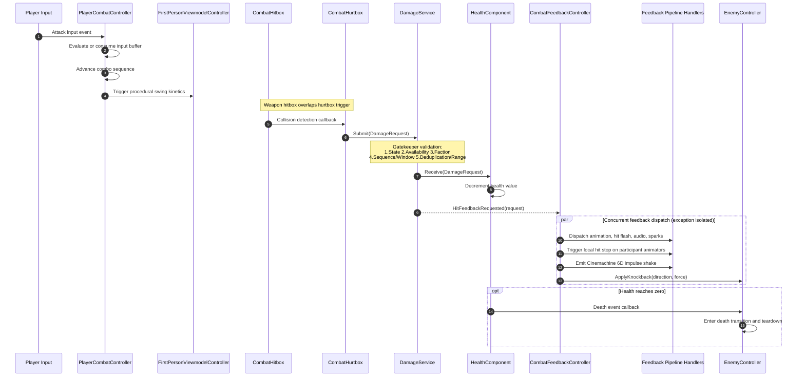

# Tiny Adventure Technical Architecture and System Design

> Language: [English](INTRODUCTION.md) | [简体中文](INTRODUCTION_zh.md) | [日本語](INTRODUCTION_jp.md)

## 1. Technical Specifications

[Tiny Adventure](./) is a first-person melee sword combat project built on Unity 6. The core gameplay focuses on arena duel mechanics, decoupled combat validation, a pipelined hit feedback bus, first-person viewmodel kinetics, and enemy behavioral steering.

| Dimension | Specification | Notes |
|---|---|---|
| **Engine & Pipeline** | Unity 6000.5.9f1 / URP Blank | Universal Render Pipeline |
| **Dependency Injection** | VContainer 1.19.0 | [GameLifetimeScope](Assets/Scripts/Core/GameLifetimeScope.cs) centralizes service registration and injection; no scene reflection scans |
| **Input System** | Unity Input System 1.20.0 | Generated code from [InputSystem.inputactions](Assets/InputSystem.inputactions), read via [InputReader](Assets/Scripts/Input/InputReader.cs) as snapshots |
| **Camera System** | Unity Cinemachine 3.1.6 | First-person virtual camera driven by strongly-typed PanTilt InputAxis with impulse listener |
| **AI Navigation** | Unity AI Navigation 2.0.14 | NavMeshAgent pathfinding decoupled from physical rotation and anti-clipping distance limits |
| **Pause Management** | Reference-counted [PauseService](Assets/Scripts/Core/PauseService.cs) | Aggregates pause requests across multiple sources to manage cursor locking and input availability |
| **Domain Results** | Zero-allocation struct [Result](Assets/Scripts/Core/Result.cs) | Domain enum [GameError](Assets/Scripts/Core/GameError.cs) replaces exception throwing on performance-critical paths |
| **Code Conventions** | `namespace TinyAdventure` | In-source XML documentation and diagnostics follow concise Japanese standards |

---

## 2. Core Architectural Principles

### 2.1 Single Legal Gateway for Damage Verification
The weapon trigger [CombatHitbox](Assets/Scripts/Combat/CombatHitbox.cs) only collects overlapping target candidates and is prohibited from modifying health directly. All damage calculations are encapsulated into an immutable [DamageRequest](Assets/Scripts/Combat/DamageRequest.cs) struct and submitted to [DamageService](Assets/Scripts/Combat/DamageService.cs). The service executes a sequential gatekeeper pipeline:
1. Global gameplay state validation
2. Entity availability and alive check for both parties
3. Opposite faction verification
4. Attack sequence validity and deduplication check
5. Spatial distance threshold validation

Upon passing validation, [HealthComponent](Assets/Scripts/Combat/HealthComponent.cs) applies the health reduction and dispatches hit events.

### 2.2 Physical Separation of Hurtbox and Movement Collider
Movement collision and combat hit registration are completely decoupled. The root physical controller handles spatial boundary collision, while hit detection is delegated to an independent [CombatHurtbox](Assets/Scripts/Combat/CombatHurtbox.cs) trigger. This component defines hitbox body-part multipliers and automatically disables its collider upon entity death, eliminating collision deadlocks and clipping issues.

### 2.3 Pipelined Combat Feedback Bus with Exception Isolation
[CombatFeedbackController](Assets/Scripts/Combat/CombatFeedbackController.cs) subscribes to damage service events, deduplicates against attack sequence and target combinations, and dispatches requests down a modular feedback pipeline:
- [AnimationFeedbackHandler](Assets/Scripts/Combat/FeedbackHandlers/AnimationFeedbackHandler.cs): Triggers target flinch or reaction animation
- [HitFlashFeedbackHandler](Assets/Scripts/Combat/FeedbackHandlers/HitFlashFeedbackHandler.cs): Drives transient material emission via MaterialPropertyBlock
- [AudioFeedbackHandler](Assets/Scripts/Combat/FeedbackHandlers/AudioFeedbackHandler.cs): Plays multi-channel normal/lethal 3D sound effects with pitch jitter
- [VfxFeedbackHandler](Assets/Scripts/Combat/FeedbackHandlers/VfxFeedbackHandler.cs): Spawns impact spark particles aligned to the contact normal
- [CameraShakeFeedbackHandler](Assets/Scripts/Combat/FeedbackHandlers/CameraShakeFeedbackHandler.cs): Dispatches Cinemachine Impulse spatial vibrations
- [HitStopFeedbackHandler](Assets/Scripts/Combat/FeedbackHandlers/HitStopFeedbackHandler.cs): Pauses participant animators locally without touching global Time.timeScale
- [IKnockbackReceiver](Assets/Scripts/Combat/CombatFeedbackContracts.cs): Dispatches directional impulse to target locomotion

Any failure in a feedback handler is isolated on site, preventing presentation errors from breaking core combat resolution.

### 2.4 Four-Tier Component Connection and Dependency Topology
The project enforces a strict four-tier connection hierarchy to eliminate implicit coupling and scene queries:

```text
[Systems / Data / Managers]   --->  VContainer Injection (Interface-driven)
         │
[Cross-module Presentation]   --->  VContainer Injection of View Components / EntryPoints
         │
[Prefab Internal Wiring]      --->  [SerializeField] Connected in Inspector
         │
[Same GameObject Hard Deps]   --->  [RequireComponent] + GetComponent() Cached in Awake
```

The scene root utilizes [GameLifetimeScope](Assets/Scripts/Core/GameLifetimeScope.cs) to declare service bindings and scene controllers. Core systems and managers are strictly interface-driven (such as [IDamageService](Assets/Scripts/Combat/IDamageService.cs), [IGameplayClock](Assets/Scripts/Core/GameplayClock.cs), and [IPauseService](Assets/Scripts/Core/IPauseService.cs)) and injected via `[Inject] public void Construct(...)`. Prefab internal child components are linked explicitly via serialized Inspector fields. Hard component dependencies residing on the same GameObject enforce `[RequireComponent]` and cache references directly during `Awake`.

### 2.5 Multi-Source Reference-Counted Pause Management
[PauseService](Assets/Scripts/Core/PauseService.cs) maintains a reference counter across pause requesters such as settings dialogs and end-game screens. The service toggles cursor lock states and enables or disables player input based on active source count, preventing nested UI flows from inadvertently releasing pause states.

### 2.6 First-Person Viewmodel Kinetics and Shadow Separation
The third-person body mesh is configured to ShadowsOnly via [PlayerFirstPersonMeshHandler](Assets/Scripts/Player/PlayerFirstPersonMeshHandler.cs), rendering ground shadows while eliminating near-plane camera clipping. The viewmodel weapon is rendered independently through [FirstPersonViewmodelController](Assets/Scripts/Player/FirstPersonViewmodelController.cs), integrating:
- [ViewmodelSwayAndBob](Assets/Scripts/Player/Viewmodel/ViewmodelSwayAndBob.cs): Inertial weapon sway and movement bobbing
- [ViewmodelAttackKinetics](Assets/Scripts/Player/Viewmodel/ViewmodelAttackKinetics.cs): Procedural swing trajectories and recoil jolt
- [ViewmodelBladeVisuals](Assets/Scripts/Player/Viewmodel/ViewmodelBladeVisuals.cs): Weapon trail generation and HDR blade emission

### 2.7 Underdamped Trauma Spring and Aim Invariance
[FirstPersonCameraController](Assets/Scripts/Camera/FirstPersonCameraController.cs) computes hit trauma through a second-order underdamped harmonic oscillator. Induced pitch kick and roll tilt are applied purely as dynamic render offsets to the virtual camera. The player mouse look base angle is never mutated; once oscillations decay, the crosshair returns exactly to its origin.

### 2.8 Input Buffering and Combo State Machine
[PlayerCombatController](Assets/Scripts/Player/PlayerCombatController.cs) maintains a 0.25-second input buffer to capture attack inputs during recovery frames. Coupled with [ComboAttackConfig](Assets/Scripts/Combat/Configs/ComboAttackConfig.cs), it orchestrates a three-stage light attack sequence with window timeouts and state reset guarantees.

### 2.9 Enemy Decoupled Movement and Anti-Clipping Constraints
[EnemyController](Assets/Scripts/Enemy/EnemyController.cs) manages enemy AI states. NavMeshAgent handles path calculation while an independent smoothing routine steers rotation. A 2.1m stopping distance and a 2.35m attack range are strictly enforced to prevent overlapping or face-hugging issues. The controller also implements [IKnockbackReceiver](Assets/Scripts/Combat/CombatFeedbackContracts.cs) for physical pushback.

### 2.10 Contract Assertion and Lightweight Result Separation
- **Unrecoverable Errors**: Never swallow exceptions or downgrade contract violations silently. Use Assert statements to enforce invariants and dependency validity, ensuring caller code paths can be inlined cleanly by the JIT compiler.
- **Recoverable Errors**: Never throw exceptions across standard operational flows. Use the zero-allocation read-only value type [Result](Assets/Scripts/Core/Result.cs) or `Result<T>` with the [GameError](Assets/Scripts/Core/GameError.cs) domain enum to propagate failure context without runtime overhead.

### 2.11 Hot-Path Zero-Overhead Discipline
- **Eliminate Inlining Blockers**: High-frequency methods (Update, FixedUpdate, collision overlap scans, damage submission pipelines) strictly avoid `try/catch` blocks or methods containing `throw` to eliminate unwinding tables and guarantee aggressive JIT inlining.
- **Eliminate Redundant Branching**: Hot paths ban defensive null checks (e.g. redundant `arg == null`) and avoid `event?.Invoke()` delegate invocation overhead, relying on initialization-phase contract assertions and direct interface dispatches.

---

## 3. Architecture Diagrams and Data Flow

### 3.1 Layered Dependency Graph

```mermaid
graph TD
    subgraph Input_Layer ["1. Input Layer"]
        Actions["InputSystem.inputactions"] --> Generated["InputSystem.cs"]
        Generated --> Reader["InputReader"]
        Reader --> CamReader["CameraInputReader"]
    end

    subgraph Core_Layer ["2. Core Services & Lifecycle"]
        Scope["GameLifetimeScope (IoC Container)"]
        Flow["GameFlowController (State Machine)"]
        Clock["GameplayClock (Decoupled Clock)"]
        Pause["PauseService (Ref-Counted Pause)"]
        Registry["SceneReferenceRegistry (Entity Index)"]
        Settings["GameSettingsService (Settings Persistence)"]
        Tracker["GameplayWinLossTracker (Match Observer)"]
        
        Scope --> Flow
        Scope --> Clock
        Scope --> Pause
        Scope --> Registry
        Scope --> Settings
        Flow --> Tracker
    end

    subgraph Player_Presentation ["3. Player Locomotion & Viewmodel"]
        PC["PlayerController (Locomotion)"]
        PCC["PlayerCombatController (Combo / Buffer)"]
        FPVC["FirstPersonViewmodelController"]
        Kinetics["ViewmodelAttackKinetics"]
        Sway["ViewmodelSwayAndBob"]
        Blade["ViewmodelBladeVisuals"]
        Shadow["PlayerFirstPersonMeshHandler"]
        
        Reader --> PC
        Reader --> PCC
        PCC --> FPVC
        FPVC --> Kinetics
        FPVC --> Sway
        FPVC --> Blade
        PC --> Shadow
    end

    subgraph Enemy_Subsystem ["4. Enemy AI & Motor"]
        EC["EnemyController (AI State / Motor / Combat)"]
        EAD["EnemyAnimationDriver"]
        NMA["NavMeshAgent"]
        
        EC --> EAD
        EC --> NMA
    end

    subgraph Combat_Subsystem ["5. Combat Validation & Health"]
        DS["DamageService (Single Gateway)"]
        HitboxP["CombatHitbox (Player)"]
        HitboxE["CombatHitbox (Enemy)"]
        HurtboxP["CombatHurtbox (Player)"]
        HurtboxE["CombatHurtbox (Enemy)"]
        HealthP["HealthComponent (Player)"]
        HealthE["HealthComponent (Enemy)"]
        
        HitboxP -.->|Overlap| HurtboxE
        HitboxE -.->|Overlap| HurtboxP
        HurtboxE -->|Submit DamageRequest| DS
        HurtboxP -->|Submit DamageRequest| DS
        DS -->|Valid| HealthE
        DS -->|Valid| HealthP
    end

    subgraph Feedback_Pipeline ["6. Feedback Pipeline"]
        CFC["CombatFeedbackController (Dispatcher)"]
        DS -.->|HitFeedbackRequested| CFC
        
        CFC --> ModAnim["AnimationFeedbackHandler"]
        CFC --> ModFlash["HitFlashFeedbackHandler"]
        CFC --> ModAudio["AudioFeedbackHandler"]
        CFC --> ModVfx["VfxFeedbackHandler"]
        CFC --> ModCam["CameraShakeFeedbackHandler"]
        CFC --> ModStop["HitStopFeedbackHandler"]
        CFC -.->|Knockback Force| EC
    end

    subgraph Camera_UI ["7. Camera & UI Presentation"]
        CamCtrl["FirstPersonCameraController"]
        Trauma["Trauma Spring Solver"]
        CM["Cinemachine CM_FirstPerson"]
        HUD["DemoHudController"]
        EHB["EnemyHealthBar"]
        SettingsUI["SettingsDialogController"]
        
        CamReader --> CamCtrl
        CamCtrl --> Trauma
        Trauma --> CM
        Flow --> HUD
        Settings --> SettingsUI
        Pause --> SettingsUI
        HealthE --> EHB
    end
```



### 3.2 Combat Resolution and Feedback Sequence



### 3.3 Global Lifecycle and Pause State Machine

```mermaid
stateDiagram-v2
    [*] --> Boot: Load SampleScene
    
    state Boot {
        [*] --> ServiceRegistration: GameLifetimeScope builds container
        ServiceRegistration --> ReferenceResolution: Bind scene references
        ReferenceResolution --> SnapshotCapture: Store initial SpawnSnapshot
        SnapshotCapture --> SettingsInit: Load persistent settings and sync FOV
    }

    Boot --> Running: Dependencies resolved and verified

    state Running {
        [*] --> ActiveGameplay: Clocks tick; accept move, look, attack inputs
    }

    Running --> Paused: PauseService registers active pause source
    state Paused {
        [*] --> SuspendedInput: Release cursor, suspend combat inputs, freeze clock
    }
    Paused --> Running: All pause sources released; lock cursor and restore input

    Running --> Victory: All active enemies eliminated
    Running --> Defeat: Player health reaches zero

    state TerminalState {
        Victory
        Defeat
    }

    TerminalState --> Restarting: Trigger restart command
    Restarting --> Boot: Restore snapshot and reset scene
```



### 3.4 Enemy AI Decision and Locomotion State Machine

```mermaid
stateDiagram-v2
    [*] --> Idle: Initialize component
    
    Idle --> Chase: Target acquired and valid
    state Chase {
        [*] --> PathComputing: NavMeshAgent updates path
        PathComputing --> RotationSteering: Smoothly steer toward target
        RotationSteering --> DistanceConstraint: Enforce stopping distance
    }

    Chase --> Attack: Target in melee range and cooldown elapsed
    state Attack {
        [*] --> OrientTarget: Halt translation and face target
        OrientTarget --> PlayAnimation: Trigger melee swing animation
        PlayAnimation --> WindowTracking: Track damage window open/close
    }

    Attack --> Chase: Swing finished and target outside range
    Attack --> Attack: Swing finished, target in range, cooldown ready

    Chase --> Knockback: Receive hit with impulse force
    Attack --> Knockback: Receive hit with impulse force
    state Knockback {
        [*] --> DampenVelocity: Translate along hit vector and dampen
    }
    Knockback --> Chase: Knockback force dissipated

    Chase --> DeathTransition: Health depleted
    Attack --> DeathTransition: Health depleted
    Knockback --> DeathTransition: Health depleted
    
    state DeathTransition {
        [*] --> StopAgent: Disable NavMeshAgent and hurtbox
        StopAgent --> PlayDeathAnim: Play death animation with fallback timer
    }

    DeathTransition --> Removed: Animation completes or timeout fires; disable GameObject
```



---

## 4. Source Module Specifications

The project source code resides under `Assets/Scripts/` across 7 architectural modules comprising 64 C# scripts.

### 4.1 Camera

| Script Path | Core Types | Primary Responsibility | Key Collaborators |
|---|---|---|---|
| [FirstPersonCameraController.cs](Assets/Scripts/Camera/FirstPersonCameraController.cs) | `FirstPersonCameraController` | Core first-person camera driver; translates mouse input into Yaw/Pitch, computes underdamped trauma spring offsets, and updates Cinemachine PanTilt | [CameraInputReader](Assets/Scripts/Input/CameraInputReader.cs), `CinemachinePanTilt`, [IGameSettingsService](Assets/Scripts/Core/IGameSettingsService.cs) |
| [CombatCameraFeedback.cs](Assets/Scripts/Camera/CombatCameraFeedback.cs) | `CombatCameraFeedback` | Camera feedback bridge; triggers Cinemachine Impulse 6D spatial camera shake | `CinemachineImpulseSource`, [CombatFeedbackProfile](Assets/Scripts/Combat/CombatFeedbackProfile.cs) |

### 4.2 Combat

#### Combat Resolution and Health Management

| Script Path | Core Types | Primary Responsibility | Key Collaborators |
|---|---|---|---|
| [DamageService.cs](Assets/Scripts/Combat/DamageService.cs) | `DamageService`<br>[IDamageService](Assets/Scripts/Combat/IDamageService.cs) | Central damage arbiter; enforces multi-stage gatekeeper checks and dispatches accepted hits | [DamageRequest](Assets/Scripts/Combat/DamageRequest.cs), [HealthComponent](Assets/Scripts/Combat/HealthComponent.cs), [ICombatantRegistry](Assets/Scripts/Core/CombatantRegistryContracts.cs) |
| [DamageRequest.cs](Assets/Scripts/Combat/DamageRequest.cs) | `DamageRequest`<br>`AttackKinds` | Immutable damage payload containing source, target, base amount, sequence ID, and spatial hit data | [CombatantMarker](Assets/Scripts/Core/CombatantMarker.cs) |
| [HealthComponent.cs](Assets/Scripts/Combat/HealthComponent.cs) | `HealthComponent`<br>`HealthState` | Health state manager; tracks current/maximum health and fires damage and death events | [DamageRequest](Assets/Scripts/Combat/DamageRequest.cs) |
| [CombatHitbox.cs](Assets/Scripts/Combat/CombatHitbox.cs) | `CombatHitbox` | Weapon trigger collider; detects overlaps during active attack windows and notifies tracker | [AttackWindowTracker](Assets/Scripts/Combat/AttackWindowTracker.cs), [ICombatHurtbox](Assets/Scripts/Combat/CombatHurtboxContracts.cs) |
| [CombatHurtbox.cs](Assets/Scripts/Combat/CombatHurtbox.cs) | `CombatHurtbox` | Standalone hurtbox receiver; applies body-part multipliers and deactivates collider upon death | [ICombatHurtbox](Assets/Scripts/Combat/CombatHurtboxContracts.cs), [HealthComponent](Assets/Scripts/Combat/HealthComponent.cs) |
| [CombatHurtboxContracts.cs](Assets/Scripts/Combat/CombatHurtboxContracts.cs) | `ICombatHurtbox`<br>`HurtboxType` | Hurtbox contracts and body-part enum definitions | [CombatantMarker](Assets/Scripts/Core/CombatantMarker.cs), [HealthComponent](Assets/Scripts/Combat/HealthComponent.cs) |
| [AttackSequence.cs](Assets/Scripts/Combat/AttackSequence.cs) | `AttackSequence`<br>`AttackSequencePhase` | Single attack lifecycle tracker; manages window open/close with normalized time fallback | [AttackWindowTracker](Assets/Scripts/Combat/AttackWindowTracker.cs) |
| [AttackWindowTracker.cs](Assets/Scripts/Combat/AttackWindowTracker.cs) | `AttackWindowTracker` | Attack window state keeper; maintains targets hit in the current sequence to deduplicate hits | [CombatantMarker](Assets/Scripts/Core/CombatantMarker.cs) |
| [HitFlashReceiver.cs](Assets/Scripts/Combat/HitFlashReceiver.cs) | `HitFlashReceiver` | Material hit-flash receiver; applies zero-allocation emission via MaterialPropertyBlock | `Renderer`, `MaterialPropertyBlock` |
| [HitStopController.cs](Assets/Scripts/Combat/HitStopController.cs) | `HitStopController`<br>[IHitStopController](Assets/Scripts/Combat/IHitStopController.cs) | Local hit stop hub; issues pause tokens to participant animators without mutating Time.timeScale | [HitStopParticipant](Assets/Scripts/Combat/HitStopParticipant.cs) |
| [HitStopParticipant.cs](Assets/Scripts/Combat/HitStopParticipant.cs) | `HitStopParticipant` | Hit stop participant component; responds to pause and resume tokens on the attached animator | `Animator` |
| [SwordTrailController.cs](Assets/Scripts/Combat/SwordTrailController.cs) | `SwordTrailController` | Weapon blade trail controller; toggles TrailRenderer emission during active swing windows | `TrailRenderer` |
| [IAttackHitListener.cs](Assets/Scripts/Combat/IAttackHitListener.cs) | `IAttackHitListener` | Callback interface for attack hit events | None |
| [IHitFeedbackReceiver.cs](Assets/Scripts/Combat/IHitFeedbackReceiver.cs) | `IHitFeedbackReceiver` | Hit feedback receiver interface | [CombatFeedbackRequest](Assets/Scripts/Combat/CombatFeedbackContracts.cs) |

#### Feedback Pipeline and Handlers

| Script Path | Core Types | Primary Responsibility | Key Collaborators |
|---|---|---|---|
| [CombatFeedbackController.cs](Assets/Scripts/Combat/CombatFeedbackController.cs) | `CombatFeedbackController` | Hit feedback central dispatcher; routes requests down handlers with deduplication and error isolation | [DamageService](Assets/Scripts/Combat/DamageService.cs), Feedback Handlers |
| [CombatFeedbackContracts.cs](Assets/Scripts/Combat/CombatFeedbackContracts.cs) | `ICombatFeedbackModule`<br>`IKnockbackReceiver`<br>`CombatFeedbackRequest` | Feedback module contracts, knockback receiver interface, and feedback request payload | [DamageRequest](Assets/Scripts/Combat/DamageRequest.cs) |
| [CombatFeedbackProfile.cs](Assets/Scripts/Combat/CombatFeedbackProfile.cs) | `CombatFeedbackProfile` | Combat feedback profile asset; defines hit stop lengths, shake parameters, audio, and VFX references | ScriptableObject |
| [AnimationFeedbackHandler.cs](Assets/Scripts/Combat/FeedbackHandlers/AnimationFeedbackHandler.cs) | `AnimationFeedbackHandler` | Feedback handler; triggers target flinch and reaction animation states | `Animator` |
| [HitFlashFeedbackHandler.cs](Assets/Scripts/Combat/FeedbackHandlers/HitFlashFeedbackHandler.cs) | `HitFlashFeedbackHandler` | Feedback handler; triggers target material emission flash | [HitFlashReceiver](Assets/Scripts/Combat/HitFlashReceiver.cs) |
| [AudioFeedbackHandler.cs](Assets/Scripts/Combat/FeedbackHandlers/AudioFeedbackHandler.cs) | `AudioFeedbackHandler` | Feedback handler; plays spatial normal/lethal hit SFX and sword swing whoosh | `AudioSource`, [CombatFeedbackProfile](Assets/Scripts/Combat/CombatFeedbackProfile.cs) |
| [VfxFeedbackHandler.cs](Assets/Scripts/Combat/FeedbackHandlers/VfxFeedbackHandler.cs) | `VfxFeedbackHandler` | Feedback handler; instantiates spark VFX aligned to the contact normal | `ParticleSystem`, [CombatFeedbackProfile](Assets/Scripts/Combat/CombatFeedbackProfile.cs) |
| [CameraShakeFeedbackHandler.cs](Assets/Scripts/Combat/FeedbackHandlers/CameraShakeFeedbackHandler.cs) | `CameraShakeFeedbackHandler` | Feedback handler; dispatches Cinemachine 6D impulse vibrations | `CinemachineImpulseSource` |
| [HitStopFeedbackHandler.cs](Assets/Scripts/Combat/FeedbackHandlers/HitStopFeedbackHandler.cs) | `HitStopFeedbackHandler` | Feedback handler; coordinates local hit stop on attacker and defender | [HitStopController](Assets/Scripts/Combat/HitStopController.cs) |

#### Combat Configurations

| Script Path | Core Types | Primary Responsibility | Key Collaborators |
|---|---|---|---|
| [AttackConfig.cs](Assets/Scripts/Combat/Configs/AttackConfig.cs) | `AttackConfig` | Single attack configuration; defines damage, knockback, forward lunge force, and window timings | ScriptableObject |
| [ComboAttackConfig.cs](Assets/Scripts/Combat/Configs/ComboAttackConfig.cs) | `ComboAttackConfig` | Combo chain configuration; links three attack stages and defines combo reset duration | [AttackConfig](Assets/Scripts/Combat/Configs/AttackConfig.cs) |
| [CharacterStatsConfig.cs](Assets/Scripts/Combat/Configs/CharacterStatsConfig.cs) | `CharacterStatsConfig` | Base character stats configuration; defines health, locomotion speeds, and turn rates | ScriptableObject |

### 4.3 Core

| Script Path | Core Types | Primary Responsibility | Key Collaborators |
|---|---|---|---|
| [GameLifetimeScope.cs](Assets/Scripts/Core/GameLifetimeScope.cs) | `GameLifetimeScope` | VContainer scene lifetime scope; registers singletons and injects dependencies into hierarchy objects | `VContainer`, Core Services |
| [GameFlowController.cs](Assets/Scripts/Core/GameFlowController.cs) | `GameFlowController`<br>`IGameplayStateProvider` | Global match state machine; coordinates boot sequences, match victory/defeat, and restart flows | [SceneReferenceRegistry](Assets/Scripts/Core/SceneReferenceRegistry.cs), [GameplayClock](Assets/Scripts/Core/GameplayClock.cs) |
| [GameplayState.cs](Assets/Scripts/Core/GameplayState.cs) | `GameplayState` | Global match state enumeration: Boot, Running, Victory, Defeat, Restarting | None |
| [GameplayClock.cs](Assets/Scripts/Core/GameplayClock.cs) | `GameplayClock`<br>`IGameplayClock` | Decoupled logic clock; freezes independently upon match completion, implements VContainer tickables | `ITickable`, `IFixedTickable` |
| [PauseService.cs](Assets/Scripts/Core/PauseService.cs) | `PauseService`<br>[IPauseService](Assets/Scripts/Core/IPauseService.cs) | Reference-counted pause manager; centralizes input enablement and cursor lock states | [InputReader](Assets/Scripts/Input/InputReader.cs) |
| [GameSettingsService.cs](Assets/Scripts/Core/GameSettingsService.cs) | `GameSettingsService`<br>[IGameSettingsService](Assets/Scripts/Core/IGameSettingsService.cs) | Settings persistence service; manages FOV and mouse sensitivity with change notification events | `PlayerPrefsSettingsStorage` |
| [SceneReferenceRegistry.cs](Assets/Scripts/Core/SceneReferenceRegistry.cs) | `SceneReferenceRegistry`<br>[ICombatantRegistry](Assets/Scripts/Core/CombatantRegistryContracts.cs) | Scene entity registry; tracks player and enemy references and stores spawn snapshots | [CombatantMarker](Assets/Scripts/Core/CombatantMarker.cs), [SpawnSnapshot](Assets/Scripts/Core/SpawnSnapshot.cs) |
| [CombatantMarker.cs](Assets/Scripts/Core/CombatantMarker.cs) | `CombatantMarker`<br>`CombatantFaction` | Combatant identity marker; identifies faction, unique identifier, and combat availability | `ICombatant` |
| [CombatantRegistryContracts.cs](Assets/Scripts/Core/CombatantRegistryContracts.cs) | `ICombatant`<br>`ICombatantRegistry` | Combatant entity and registry contracts | [CombatantMarker](Assets/Scripts/Core/CombatantMarker.cs) |
| [GameplayWinLossTracker.cs](Assets/Scripts/Core/GameplayWinLossTracker.cs) | `GameplayWinLossTracker` | Match outcome observer; monitors player and enemy health states to trigger victory or defeat | [HealthComponent](Assets/Scripts/Combat/HealthComponent.cs), [GameFlowController](Assets/Scripts/Core/GameFlowController.cs) |
| [GameFlowInputHandler.cs](Assets/Scripts/Core/GameFlowInputHandler.cs) | `GameFlowInputHandler` | Match flow input listener; processes restart and exit inputs | [InputReader](Assets/Scripts/Input/InputReader.cs) |
| [SpawnSnapshot.cs](Assets/Scripts/Core/SpawnSnapshot.cs) | `SpawnSnapshot` | Read-only spawn snapshot; captures initial position, rotation, and health for instant restart | UnityEngine |
| [Result.cs](Assets/Scripts/Core/Result.cs) | `Result`<br>`Result<T>` | Zero-allocation result struct; encapsulates domain successes and errors without exceptions | [GameError](Assets/Scripts/Core/GameError.cs) |
| [GameError.cs](Assets/Scripts/Core/GameError.cs) | `GameError` | Domain error code enumeration | None |
| [GameAppUtils.cs](Assets/Scripts/Core/GameAppUtils.cs) | `GameAppUtils` | Application exit utility; handles platform divergence between Editor and standalone build | UnityEngine |

### 4.4 Enemy

| Script Path | Core Types | Primary Responsibility | Key Collaborators |
|---|---|---|---|
| [EnemyController.cs](Assets/Scripts/Enemy/EnemyController.cs) | `EnemyController` | Enemy unified controller; combines AI decision states, NavMesh tracking, anti-clipping distance limits, attack execution, knockback, and death lifecycle | `NavMeshAgent`, [CombatHitbox](Assets/Scripts/Combat/CombatHitbox.cs), [DamageService](Assets/Scripts/Combat/DamageService.cs), [IKnockbackReceiver](Assets/Scripts/Combat/CombatFeedbackContracts.cs) |
| [EnemyAnimationDriver.cs](Assets/Scripts/Enemy/EnemyAnimationDriver.cs) | `EnemyAnimationDriver` | Enemy animation driver; maps locomotion speed to locomotion blends and fires attack, flinch, and death triggers | `Animator` |

### 4.5 Input

| Script Path | Core Types | Primary Responsibility | Key Collaborators |
|---|---|---|---|
| [InputSystem.cs](Assets/Scripts/Input/InputSystem.cs) | `InputSystem` | Strongly-typed C# wrapper generated by Unity Input System | Unity.InputSystem |
| [InputReader.cs](Assets/Scripts/Input/InputReader.cs) | `InputReader`<br>`GameplayInputSnapshot` | Primary business input reader; generates immutable input snapshots and supports input suspension | [InputSystem](Assets/Scripts/Input/InputSystem.cs) |
| [CameraInputReader.cs](Assets/Scripts/Input/CameraInputReader.cs) | `CameraInputReader`<br>`CameraInputSnapshot` | Camera look input reader; extracts filtered, smoothed view rotation delta vectors | [InputReader](Assets/Scripts/Input/InputReader.cs) |

### 4.6 Player

| Script Path | Core Types | Primary Responsibility | Key Collaborators |
|---|---|---|---|
| [PlayerController.cs](Assets/Scripts/Player/PlayerController.cs) | `PlayerController` | Character locomotion controller; drives camera-relative movement and ground detection via CharacterController | `CharacterController`, [InputReader](Assets/Scripts/Input/InputReader.cs) |
| [PlayerCombatController.cs](Assets/Scripts/Player/PlayerCombatController.cs) | `PlayerCombatController` | Player melee combat master; manages 3-stage combo transitions and a 0.25s input buffer | [DamageService](Assets/Scripts/Combat/DamageService.cs), [ComboAttackConfig](Assets/Scripts/Combat/Configs/ComboAttackConfig.cs), [FirstPersonViewmodelController](Assets/Scripts/Player/FirstPersonViewmodelController.cs) |
| [PlayerAnimationDriver.cs](Assets/Scripts/Player/PlayerAnimationDriver.cs) | `PlayerAnimationDriver` | Third-person knight animator driver; updates locomotion blends and triggers attack animations | `Animator` |
| [PlayerFirstPersonMeshHandler.cs](Assets/Scripts/Player/PlayerFirstPersonMeshHandler.cs) | `PlayerFirstPersonMeshHandler` | Shadow-separation handler; switches third-person body meshes to ShadowsOnly to prevent clipping | `SkinnedMeshRenderer` |
| [FirstPersonViewmodelController.cs](Assets/Scripts/Player/FirstPersonViewmodelController.cs) | `FirstPersonViewmodelController`<br>[IPlayerViewmodel](Assets/Scripts/Player/IPlayerViewmodel.cs) | First-person viewmodel presentation hub; orchestrates weapon attack kinetics, sway, and blade visuals | Viewmodel Submodules |
| [ViewmodelSwayAndBob.cs](Assets/Scripts/Player/Viewmodel/ViewmodelSwayAndBob.cs) | `ViewmodelSwayAndBob` | Computes procedural viewmodel inertial sway and walking/sprinting bobbing | UnityEngine |
| [ViewmodelAttackKinetics.cs](Assets/Scripts/Player/Viewmodel/ViewmodelAttackKinetics.cs) | `ViewmodelAttackKinetics` | Computes weapon swing translation/rotation paths, hit micro-jitter, and recoil jolt | [ViewmodelAttackKineticsConfig](Assets/Scripts/Player/Viewmodel/ViewmodelAttackKineticsConfig.cs) |
| [ViewmodelAttackKineticsConfig.cs](Assets/Scripts/Player/Viewmodel/ViewmodelAttackKineticsConfig.cs) | `ViewmodelAttackKineticsConfig`<br>`AttackMotionPose` | Configuration asset for viewmodel swing poses and hurt recoil parameters | ScriptableObject |
| [ViewmodelBladeVisuals.cs](Assets/Scripts/Player/Viewmodel/ViewmodelBladeVisuals.cs) | `ViewmodelBladeVisuals` | Controls viewmodel sword TrailRenderer fading and HDR blade emission during swings | `TrailRenderer`, `MaterialPropertyBlock` |

### 4.7 UI

| Script Path | Core Types | Primary Responsibility | Key Collaborators |
|---|---|---|---|
| [DemoHudController.cs](Assets/Scripts/UI/DemoHudController.cs) | `DemoHudController` | Combat HUD controller; observes player health, active enemy counts, and shows victory/defeat panels | [GameFlowController](Assets/Scripts/Core/GameFlowController.cs), [HealthComponent](Assets/Scripts/Combat/HealthComponent.cs) |
| [EnemyHealthBar.cs](Assets/Scripts/UI/EnemyHealthBar.cs) | `EnemyHealthBar` | World-space enemy health bar; faces camera with billboard alignment, two-tier delayed bar fill, and idle fadeout | [HealthComponent](Assets/Scripts/Combat/HealthComponent.cs) |
| [SettingsDialogController.cs](Assets/Scripts/UI/SettingsDialogController.cs) | `SettingsDialogController` | Settings dialog controller; binds FOV and mouse sensitivity sliders, coordinates with PauseService to freeze match | [GameSettingsService](Assets/Scripts/Core/GameSettingsService.cs), [IPauseService](Assets/Scripts/Core/IPauseService.cs) |

---

## 5. Scene Hierarchy and Prefab Design

### 5.1 Semantic Root Node Structure

The primary game scene resides at [Assets/Scenes/SampleScene.unity](Assets/Scenes/SampleScene.unity), organized into five semantic root nodes:

1. **`_MANAGEMENT_`**
   - `GameRoot`: Hosts [GameLifetimeScope](Assets/Scripts/Core/GameLifetimeScope.cs) and core services ([DamageService](Assets/Scripts/Combat/DamageService.cs), [GameFlowController](Assets/Scripts/Core/GameFlowController.cs), [GameplayClock](Assets/Scripts/Core/GameplayClock.cs), [SceneReferenceRegistry](Assets/Scripts/Core/SceneReferenceRegistry.cs), [CombatFeedbackController](Assets/Scripts/Combat/CombatFeedbackController.cs), [HitStopController](Assets/Scripts/Combat/HitStopController.cs), [CombatCameraFeedback](Assets/Scripts/Camera/CombatCameraFeedback.cs)).
   - `Navigation`: Contains navigation meshes and spawn point anchors.
2. **`_ENVIRONMENT_`**
   - Contains arena geometry, boundary colliders, directional lighting, and the global post-processing volume.
3. **`_CHARACTERS_`**
   - `Player`: Knight player instance, instantiated from [Knight.prefab](Assets/Prefabs/KayKitBattle/Knight.prefab).
   - `Enemies`: Enemy container hosting instances from [Enemy_Melee.prefab](Assets/Prefabs/KayKitBattle/Enemy_Melee.prefab).
4. **`_CAMERAS_`**
   - Contains the main camera and the first-person Cinemachine virtual camera with `CinemachineImpulseListener`.
5. **`_UI_`**
   - Contains the UI canvas instantiated from [HUDRoot.prefab](Assets/Prefabs/KayKitBattle/HUDRoot.prefab) and the EventSystem.

### 5.2 Core Prefab Topologies

#### [Knight.prefab](Assets/Prefabs/KayKitBattle/Knight.prefab)
- **Root Node**: `CharacterController`, [CombatantMarker](Assets/Scripts/Core/CombatantMarker.cs) (`Faction: Player`), [HealthComponent](Assets/Scripts/Combat/HealthComponent.cs), [HitFlashReceiver](Assets/Scripts/Combat/HitFlashReceiver.cs), [PlayerController](Assets/Scripts/Player/PlayerController.cs), [PlayerCombatController](Assets/Scripts/Player/PlayerCombatController.cs), [HitStopParticipant](Assets/Scripts/Combat/HitStopParticipant.cs), [InputReader](Assets/Scripts/Input/InputReader.cs), [CameraInputReader](Assets/Scripts/Input/CameraInputReader.cs).
- **Hurtbox Node `Hurtboxes/TorsoHurtbox`**: [CombatHurtbox](Assets/Scripts/Combat/CombatHurtbox.cs) with trigger `CapsuleCollider`, decoupling combat hit detection from character movement.
- **Camera Target `CameraTarget`**: Serves as the tracking and rotation reference for the Cinemachine virtual camera.
- **Viewmodel Hierarchy `CameraTarget/FirstPersonViewmodel`**: [FirstPersonViewmodelController](Assets/Scripts/Player/FirstPersonViewmodelController.cs) and weapon viewmodel mesh, featuring [SwordTrailController](Assets/Scripts/Combat/SwordTrailController.cs) and trigger [CombatHitbox](Assets/Scripts/Combat/CombatHitbox.cs).
- **Third-Person Mesh `KayKitKnight`**: [PlayerAnimationDriver](Assets/Scripts/Player/PlayerAnimationDriver.cs) and [PlayerFirstPersonMeshHandler](Assets/Scripts/Player/PlayerFirstPersonMeshHandler.cs) (configured to ShadowsOnly).

#### [Enemy_Melee.prefab](Assets/Prefabs/KayKitBattle/Enemy_Melee.prefab)
- **Root Node**: `NavMeshAgent`, movement capsule collider, [CombatantMarker](Assets/Scripts/Core/CombatantMarker.cs) (`Faction: Enemy`), [HealthComponent](Assets/Scripts/Combat/HealthComponent.cs), [HitFlashReceiver](Assets/Scripts/Combat/HitFlashReceiver.cs), [EnemyController](Assets/Scripts/Enemy/EnemyController.cs), [HitStopParticipant](Assets/Scripts/Combat/HitStopParticipant.cs).
- **Hurtbox Node `Hurtboxes/TorsoHurtbox`**: [CombatHurtbox](Assets/Scripts/Combat/CombatHurtbox.cs) with trigger `CapsuleCollider`, automatically disabled upon death.
- **Floating UI `HealthBarCanvas`**: [EnemyHealthBar](Assets/Scripts/UI/EnemyHealthBar.cs).
- **Mesh and Weapon**: [EnemyAnimationDriver](Assets/Scripts/Enemy/EnemyAnimationDriver.cs) and axe trigger [CombatHitbox](Assets/Scripts/Combat/CombatHitbox.cs).

#### [HUDRoot.prefab](Assets/Prefabs/KayKitBattle/HUDRoot.prefab)
- [DemoHudController](Assets/Scripts/UI/DemoHudController.cs): Displays player health, alive enemies count, and victory/defeat panels.
- [SettingsDialogController](Assets/Scripts/UI/SettingsDialogController.cs): Interactive sliders for FOV and mouse sensitivity; halts gameplay clock and releases mouse cursor via PauseService.

---

## 6. Configuration Assets and Assembly Definitions

### 6.1 ScriptableObject Configuration Assets

| Asset Path | Type | Core Parameters |
|---|---|---|
| [CombatFeedbackProfile.asset](Assets/Settings/CombatFeedbackProfile.asset) | [CombatFeedbackProfile](Assets/Scripts/Combat/CombatFeedbackProfile.cs) | Hit stop durations (Normal: 0.04s, Lethal: 0.08s), shake impulses, audio clips, and spark particle prefabs |
| [KnightComboAttackConfig.asset](Assets/Combat/Configs/KnightComboAttackConfig.asset) | [ComboAttackConfig](Assets/Scripts/Combat/Configs/ComboAttackConfig.cs) | Player 3-stage combo attack steps, damage escalation, forward lunges, and 1.2s reset timeout |
| [EnemyAttackConfig.asset](Assets/Combat/Configs/EnemyAttackConfig.asset) | [AttackConfig](Assets/Scripts/Combat/Configs/AttackConfig.cs) | Enemy melee damage, attack window boundaries, and knockback impulse |
| [KnightStatsConfig.asset](Assets/Combat/Configs/KnightStatsConfig.asset) | [CharacterStatsConfig](Assets/Scripts/Combat/Configs/CharacterStatsConfig.cs) | Player maximum health, movement speeds, and jump parameters |
| [EnemyStatsConfig.asset](Assets/Combat/Configs/EnemyStatsConfig.asset) | [CharacterStatsConfig](Assets/Scripts/Combat/Configs/CharacterStatsConfig.cs) | Enemy maximum health and navigation parameters |

### 6.2 Assembly Definitions

- **Main Runtime Assembly**: [TinyAdventure.asmdef](Assets/Scripts/TinyAdventure.asmdef)
  - Root Namespace: `TinyAdventure`
  - Referenced Assemblies: `Unity.InputSystem`, `Unity.Cinemachine`, `Unity.AI.Navigation`, `VContainer`
