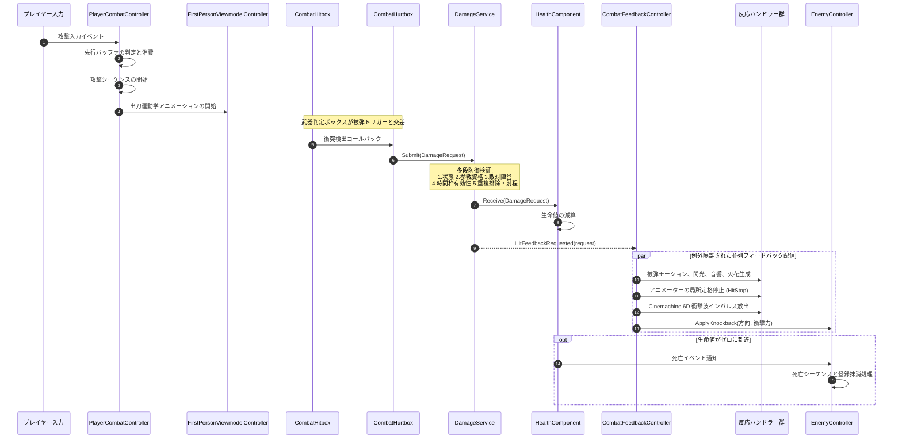
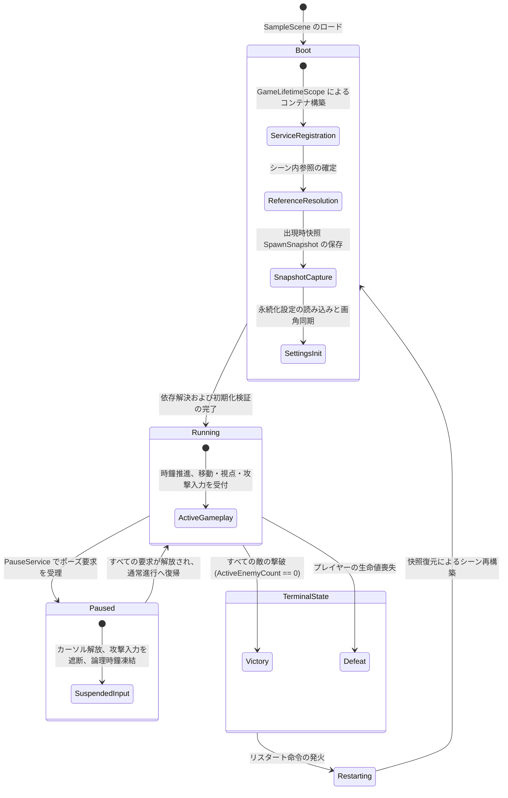
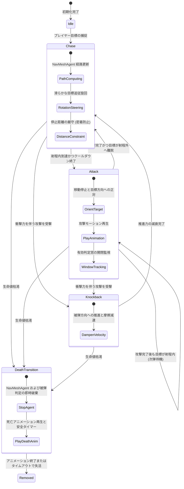

# Tiny Adventure 技術アーキテクチャ・システム設計書

> 言語切替：[English](INTRODUCTION.md) | [简体中文](INTRODUCTION_zh.md) | [日本語](INTRODUCTION_jp.md)

## 1. プロジェクト技術仕様

[Tiny Adventure](./) は Unity 6 で構築された一人称視点近接剣戟アクションゲームです。閉鎖闘技場内での戦闘判定、打撃フィードバック総線、一人称ビューモデル運動学、敵キャラクターの自律制御をコアシステムとして実装しています。

| 項目 | 選定仕様 | 概要 |
|---|---|---|
| **エンジン・描画** | Unity 6000.5.9f1 / URP Blank | Universal Render Pipeline を採用 |
| **依存注入 (DI)** | VContainer 1.19.0 | [GameLifetimeScope](Assets/Scripts/Core/GameLifetimeScope.cs) による純粋な IoC 注入。シーン内検索を全廃 |
| **入力システム** | Unity Input System 1.20.0 | [InputSystem.inputactions](Assets/InputSystem.inputactions) 自動生成クラスを用い、[InputReader](Assets/Scripts/Input/InputReader.cs) でスナップショット化 |
| **カメラシステム** | Unity Cinemachine 3.1.6 | 一人称仮想カメラ。型安全な PanTilt InputAxis 駆動および衝撃波リスナーを統合 |
| **AI ナビゲーション** | Unity AI Navigation 2.0.14 | NavMeshAgent 経路探索。物理旋回および密着防止距離制御と疎結合化 |
| **ポーズ管理** | 参照カウント式 [PauseService](Assets/Scripts/Core/PauseService.cs) | 複数のポーズ要求を一元管理し、カーソルロック状態と入力の開閉を制御 |
| **領域戻り値** | ゼロアロケーション [Result](Assets/Scripts/Core/Result.cs) | ホットパスでの例外送出を廃止し、[GameError](Assets/Scripts/Core/GameError.cs) による軽量エラーハンドリングを実現 |
| **コード規約** | `namespace TinyAdventure` | XML ドキュメントコメントおよび診断ログは簡潔明確な日本語規約に準拠 |

---

## 2. コアアーキテクチャ設計原則

### 2.1 ダメージ検証の単一合法エントリ
武器の当たり判定 [CombatHitbox](Assets/Scripts/Combat/CombatHitbox.cs) は接触候補の収集のみを担当し、生命値の直接変更を禁止しています。すべてのダメージ計算は不変構造体 [DamageRequest](Assets/Scripts/Combat/DamageRequest.cs) にカプセル化され、[DamageService](Assets/Scripts/Combat/DamageService.cs) に送信されます。本サービスは以下の防御検証パイプラインを順次実行します：
1. 全体実行状態の検証
2. 双方エンティティの参戦有効性と生存状態の検証
3. 敵対陣営の所属検証
4. 攻撃シーケンスの有効性と重複排除の検証
5. 空間距離閾値の検証

検証通過後、[HealthComponent](Assets/Scripts/Combat/HealthComponent.cs) が生命値を減算し、被弾イベントを発火します。

### 2.2 被弾判定体と移動物理衝突体の物理的分離
物理移動カプセルと戦闘被弾判定は完全に分離されています。ルートの物理コントローラーは空間境界の衝突のみを担当し、被弾判定は独立した [CombatHurtbox](Assets/Scripts/Combat/CombatHurtbox.cs) トリガーが担います。部位ごとのダメージ倍率を定義し、死亡時にはコライダーを自動無効化することで、密着時のすり抜けや当たり判定のデッドロックを排除します。

### 2.3 パイプライン化ヒットフィードバック総線と例外隔離
[CombatFeedbackController](Assets/Scripts/Combat/CombatFeedbackController.cs) はダメージサービスの命中イベントを購読し、攻撃シーケンスと対象の組み合わせによる重複排除を行った上で、モジュール化されたパイプラインへ順次配信します：
- [AnimationFeedbackHandler](Assets/Scripts/Combat/FeedbackHandlers/AnimationFeedbackHandler.cs)：被弾モーションの再生
- [HitFlashFeedbackHandler](Assets/Scripts/Combat/FeedbackHandlers/HitFlashFeedbackHandler.cs)：MaterialPropertyBlock による瞬時マテリアル発光
- [AudioFeedbackHandler](Assets/Scripts/Combat/FeedbackHandlers/AudioFeedbackHandler.cs)：通常・撃破 3D サウンドおよびピッチ微擾再生
- [VfxFeedbackHandler](Assets/Scripts/Combat/FeedbackHandlers/VfxFeedbackHandler.cs)：衝突法線方向への火花エフェクト生成
- [CameraShakeFeedbackHandler](Assets/Scripts/Combat/FeedbackHandlers/CameraShakeFeedbackHandler.cs)：Cinemachine Impulse による 6D 衝撃波放出
- [HitStopFeedbackHandler](Assets/Scripts/Combat/FeedbackHandlers/HitStopFeedbackHandler.cs)：全体時間に影響を与えない局所定格アニメーション停止
- [IKnockbackReceiver](Assets/Scripts/Combat/CombatFeedbackContracts.cs)：移動基盤への方向性物理インパルス付与

各フィードバックモジュール内で発生した例外は総線内で補足・隔離され、戦闘判定の主処理を中断させません。

### 2.4 4層コンポーネント接続・依存性トポロジー
暗黙的結合およびシーン動的検索を排除するため、厳格な4段階の接続トポロジーを規定しています：

```text
[システム/データ/Manager 之間]  --->  全走 VContainer 注入（インターフェース駆動）
         │
[跨モジュール表現層呼び出し]    --->  VContainer 注入（View コンポーネント / EntryPoint 制御）
         │
[Prefab 内部パーツ接続]        --->  [SerializeField] による Inspector 接続
         │
[同一 GameObject の必須コンポ] --->  [RequireComponent] + Awake() での GetComponent() キャッシュ
```

シーンルートの [GameLifetimeScope](Assets/Scripts/Core/GameLifetimeScope.cs) で主要サービスを登録・構築します。システム層・マネージャー層は [IDamageService](Assets/Scripts/Combat/IDamageService.cs)、[IGameplayClock](Assets/Scripts/Core/GameplayClock.cs)、[IPauseService](Assets/Scripts/Core/IPauseService.cs) 等のインターフェースに徹底して抽象化し、`[Inject] public void Construct(...)` で注入します。プレハブ内部の階層部品は Inspector のシリアライズ参照で明示的に結合し、同一オブジェクト上の必須依存コンポーネントは `[RequireComponent]` を付与した上で `Awake` 時に直接キャッシュします。

### 2.5 参照カウント方式による多発信源ポーズ管理
[PauseService](Assets/Scripts/Core/PauseService.cs) は、設定画面やリザルト画面など複数の発生源からのポーズ要求を参照カウントで管理します。有効な要求数に応じてカーソルロック状態とプレイヤー入力を一括制御し、特定 UI の終了時に他のポーズ状態が誤解除される問題を防ぎます。

### 2.6 一人称ビューモデル運動学とシャドウ分軌描画
三人称モデルは [PlayerFirstPersonMeshHandler](Assets/Scripts/Player/PlayerFirstPersonMeshHandler.cs) により影のみを描画する設定とし、カメラクリッピングを防止。一人称の手持ち武器は [FirstPersonViewmodelController](Assets/Scripts/Player/FirstPersonViewmodelController.cs) が独立描画し、以下のモジュールを統合制御します：
- [ViewmodelSwayAndBob](Assets/Scripts/Player/Viewmodel/ViewmodelSwayAndBob.cs)：視点操作時の慣性遅延と歩行呼吸揺れ
- [ViewmodelAttackKinetics](Assets/Scripts/Player/Viewmodel/ViewmodelAttackKinetics.cs)：プログラム出刀軌跡と受撃リコイル
- [ViewmodelBladeVisuals](Assets/Scripts/Player/Viewmodel/ViewmodelBladeVisuals.cs)：攻撃窓と同期した軌跡トレイルと刀身発光

### 2.7 二階減衰被弾スプリングと照準不変性
[FirstPersonCameraController](Assets/Scripts/Camera/FirstPersonCameraController.cs) は被弾時の衝撃を二階不足減衰振動子モデルで計算します。後仰角やロール角は描画オフセットとして仮想カメラ姿勢に加算されるのみであり、プレイヤー本来のマウス照準基準角は改ざんされません。揺れ収束後は完全に元の照準位置へ復帰します。

### 2.8 先行入力バッファと3段コンボステートマシン
[PlayerCombatController](Assets/Scripts/Player/PlayerCombatController.cs) は攻撃の後隙中に 0.25 秒の先行入力バッファを備え、動作終了と同時に次段を発動可能にします。[ComboAttackConfig](Assets/Scripts/Combat/Configs/ComboAttackConfig.cs) と連携して 3 段の軽攻撃コンボを管理し、タイムアウトによるリセット保護を提供します。

### 2.9 敵キャラクターの意思決定・運動分離と密着防止制約
[EnemyController](Assets/Scripts/Enemy/EnemyController.cs) は敵 AI ステートマシンを一括統括します。巡航経路計算を NavMeshAgent に委ね、旋回は独立したアルゴリズムで滑らかに補間。停止距離 2.1m および攻撃射程 2.35m を厳格に保持してプレイヤーモデルへのめり込みを防止し、同時に [IKnockbackReceiver](Assets/Scripts/Combat/CombatFeedbackContracts.cs) を実装して受撃ノックバックに対応します。

### 2.10 アサーションと軽量リザルトによるエラー分離
- **回復不能なエラー**：例外の握りつぶしや暗黙の縮退を厳禁とし、契約不変条件や強依存関係の検証には Assert を使用します。これにより、呼び出し元のコードパスが JIT コンパイラによって確実にインライン展開されることを保証します。
- **回復可能なエラー**：通常業務フローでの例外送出を禁止し、ゼロアロケーションの読み取り専用値型 [Result](Assets/Scripts/Core/Result.cs) または `Result<T>` と [GameError](Assets/Scripts/Core/GameError.cs) 領域列挙型を用いて失敗文脈を伝達します。

### 2.11 高頻度ホットパスのゼロオーバーヘッド規約
- **インライン展開阻害コードの排除**：毎フレーム実行関数（Update、FixedUpdate、当たり判定走査、ダメージ確定処理など）では `try/catch` 節や `throw` を含む分岐を厳禁とし、スタック巻き戻しテーブル生成やレジスタ退避オーバーヘッドを完全に排除します。
- **不要な分岐・委譲コストの排除**：ホットパス内での冗長な防御的 null チェック（`arg == null` 等）や `event?.Invoke()` 呼び出しを廃止し、構築時の契約アサーションと直接的なインターフェース呼び出しによりゼロコスト実行を徹底します。

---

## 3. アーキテクチャ図とデータフロー

### 3.1 レイヤー別依存関係図

```mermaid
graph TD
    subgraph Input_Layer ["1. 入力層"]
        Actions["InputSystem.inputactions"] --> Generated["InputSystem.cs"]
        Generated --> Reader["InputReader"]
        Reader --> CamReader["CameraInputReader"]
    end

    subgraph Core_Layer ["2. 核心サービス・ライフサイクル層"]
        Scope["GameLifetimeScope (IoC Container)"]
        Flow["GameFlowController (進行管理)"]
        Clock["GameplayClock (論理時鐘)"]
        Pause["PauseService (参照カウント式停止)"]
        Registry["SceneReferenceRegistry (実体索引)"]
        Settings["GameSettingsService (設定永続化)"]
        Tracker["GameplayWinLossTracker (勝敗監視)"]
        
        Scope --> Flow
        Scope --> Clock
        Scope --> Pause
        Scope --> Registry
        Scope --> Settings
        Flow --> Tracker
    end

    subgraph Player_Presentation ["3. プレイヤー制御・ビューモデル層"]
        PC["PlayerController (移動物理)"]
        PCC["PlayerCombatController (コンボ / バッファ)"]
        FPVC["FirstPersonViewmodelController"]
        Kinetics["ViewmodelAttackKinetics"]
        Sway["ViewmodelSwayAndBob"]
        Blade["ViewmodelBladeVisuals"]
        Shadow["PlayerFirstPersonMeshHandler"]
        
        Reader --> PC
        Reader --> PCC
        PCC --> FPVC
        FPVC --> Kinetics
        FPVC --> Sway
        FPVC --> Blade
        PC --> Shadow
    end

    subgraph Enemy_Subsystem ["4. 敵エージェント層"]
        EC["EnemyController (AI状態 / モーター / 戦闘)"]
        EAD["EnemyAnimationDriver"]
        NMA["NavMeshAgent"]
        
        EC --> EAD
        EC --> NMA
    end

    subgraph Combat_Subsystem ["5. 戦闘判定・生命管理層"]
        DS["DamageService (単一裁定窓口)"]
        HitboxP["CombatHitbox (Player)"]
        HitboxE["CombatHitbox (Enemy)"]
        HurtboxP["CombatHurtbox (Player)"]
        HurtboxE["CombatHurtbox (Enemy)"]
        HealthP["HealthComponent (Player)"]
        HealthE["HealthComponent (Enemy)"]
        
        HitboxP -.->|接触| HurtboxE
        HitboxE -.->|接触| HurtboxP
        HurtboxE -->|Submit DamageRequest| DS
        HurtboxP -->|Submit DamageRequest| DS
        DS -->|検証通過| HealthE
        DS -->|検証通過| HealthP
    end

    subgraph Feedback_Pipeline ["6. フィードバックパイプライン"]
        CFC["CombatFeedbackController (中枢総線)"]
        DS -.->|HitFeedbackRequested| CFC
        
        CFC --> ModAnim["AnimationFeedbackHandler"]
        CFC --> ModFlash["HitFlashFeedbackHandler"]
        CFC --> ModAudio["AudioFeedbackHandler"]
        CFC --> ModVfx["VfxFeedbackHandler"]
        CFC --> ModCam["CameraShakeFeedbackHandler"]
        CFC --> ModStop["HitStopFeedbackHandler"]
        CFC -.->|ノックバック外力| EC
    end

    subgraph Camera_UI ["7. カメラ・UI表現層"]
        CamCtrl["FirstPersonCameraController"]
        Trauma["減衰スプリング計算"]
        CM["Cinemachine CM_FirstPerson"]
        HUD["DemoHudController"]
        EHB["EnemyHealthBar"]
        SettingsUI["SettingsDialogController"]
        
        CamReader --> CamCtrl
        CamCtrl --> Trauma
        Trauma --> CM
        Flow --> HUD
        Settings --> SettingsUI
        Pause --> SettingsUI
        HealthE --> EHB
    end
```



### 3.2 戦闘判定・手応えフィードバックシーケンス



### 3.3 全体ライフサイクルとポーズステートマシン



### 3.4 敵AI意思決定と移動ステートマシン



---

## 4. ソースコードモジュール詳細

全ソースコードは `Assets/Scripts/` 配下の 7 つのモジュール（計 64 ファイル）で構成されています。

### 4.1 Camera（カメラ・視線制御）

| スクリプトパス | 主要型定義 | 主な責務 | 協調関係 |
|---|---|---|---|
| [FirstPersonCameraController.cs](Assets/Scripts/Camera/FirstPersonCameraController.cs) | `FirstPersonCameraController` | 一人称視線回転制御の核。マウス入力を Yaw/Pitch に変換し、二階減衰被弾スプリング変位を解算して Cinemachine PanTilt に出力 | [CameraInputReader](Assets/Scripts/Input/CameraInputReader.cs), `CinemachinePanTilt`, [IGameSettingsService](Assets/Scripts/Core/IGameSettingsService.cs) |
| [CombatCameraFeedback.cs](Assets/Scripts/Camera/CombatCameraFeedback.cs) | `CombatCameraFeedback` | 被弾フィードバック統合アダプター。Cinemachine Impulse による 6D 衝撃波を放出 | `CinemachineImpulseSource`, [CombatFeedbackProfile](Assets/Scripts/Combat/CombatFeedbackProfile.cs) |

### 4.2 Combat（戦闘判定・設定・フィードバック総線）

#### 戦闘判定および生命管理

| スクリプトパス | 主要型定義 | 主な責務 | 協調関係 |
|---|---|---|---|
| [DamageService.cs](Assets/Scripts/Combat/DamageService.cs) | `DamageService`<br>[IDamageService](Assets/Scripts/Combat/IDamageService.cs) | シーン唯一のダメージ裁定サービス。多段防御検証を行い、受理結果を配信 | [DamageRequest](Assets/Scripts/Combat/DamageRequest.cs), [HealthComponent](Assets/Scripts/Combat/HealthComponent.cs), [ICombatantRegistry](Assets/Scripts/Core/CombatantRegistryContracts.cs) |
| [DamageRequest.cs](Assets/Scripts/Combat/DamageRequest.cs) | `DamageRequest`<br>`AttackKinds` | 不変ダメージ要求値オブジェクト。攻撃者、受撃者、基準数値、シーケンス番号、命中座標をカプセル化 | [CombatantMarker](Assets/Scripts/Core/CombatantMarker.cs) |
| [HealthComponent.cs](Assets/Scripts/Combat/HealthComponent.cs) | `HealthComponent`<br>`HealthState` | 生命値管理コンポーネント。現在値・最大値を管理し、ダメージ適用と死亡通知を発火 | [DamageRequest](Assets/Scripts/Combat/DamageRequest.cs) |
| [CombatHitbox.cs](Assets/Scripts/Combat/CombatHitbox.cs) | `CombatHitbox` | 武器衝突判定トリガー。攻撃判定窓の開口中に重なりを検出し、トラッカーに候補を登録 | [AttackWindowTracker](Assets/Scripts/Combat/AttackWindowTracker.cs), [ICombatHurtbox](Assets/Scripts/Combat/CombatHurtboxContracts.cs) |
| [CombatHurtbox.cs](Assets/Scripts/Combat/CombatHurtbox.cs) | `CombatHurtbox` | 独立被弾判定コンポーネント。部位ダメージ倍率を定義し、死亡時にコライダーを自動無効化 | [ICombatHurtbox](Assets/Scripts/Combat/CombatHurtboxContracts.cs), [HealthComponent](Assets/Scripts/Combat/HealthComponent.cs) |
| [CombatHurtboxContracts.cs](Assets/Scripts/Combat/CombatHurtboxContracts.cs) | `ICombatHurtbox`<br>`HurtboxType` | 被弾判定体抽象契約および部位列挙型の定義 | [CombatantMarker](Assets/Scripts/Core/CombatantMarker.cs), [HealthComponent](Assets/Scripts/Combat/HealthComponent.cs) |
| [AttackSequence.cs](Assets/Scripts/Combat/AttackSequence.cs) | `AttackSequence`<br>`AttackSequencePhase` | 単一攻撃のライフサイクル管理。判定窓の開閉および正規化時間による自動閉鎖を保証 | [AttackWindowTracker](Assets/Scripts/Combat/AttackWindowTracker.cs) |
| [AttackWindowTracker.cs](Assets/Scripts/Combat/AttackWindowTracker.cs) | `AttackWindowTracker` | 攻撃窓追跡器。同一攻撃シーケンスで命中したエンティティ集合を管理し重複排除 | [CombatantMarker](Assets/Scripts/Core/CombatantMarker.cs) |
| [HitFlashReceiver.cs](Assets/Scripts/Combat/HitFlashReceiver.cs) | `HitFlashReceiver` | 被弾発光受信コンポーネント。MaterialPropertyBlock によるゼロ割当 HDR 発光を制御 | `Renderer`, `MaterialPropertyBlock` |
| [HitStopController.cs](Assets/Scripts/Combat/HitStopController.cs) | `HitStopController`<br>[IHitStopController](Assets/Scripts/Combat/IHitStopController.cs) | 局所定格中枢。参加者に定格トークンを発行し、全体時間に影響を与えず Animator を一時停止 | [HitStopParticipant](Assets/Scripts/Combat/HitStopParticipant.cs) |
| [HitStopParticipant.cs](Assets/Scripts/Combat/HitStopParticipant.cs) | `HitStopParticipant` | 定格参加者アダプター。トークン要求に応答してアニメーターの再生速度を制御 | `Animator` |
| [SwordTrailController.cs](Assets/Scripts/Combat/SwordTrailController.cs) | `SwordTrailController` | 刀光トレイル制御器。有効判定窓の期間に合わせて TrailRenderer を開閉 | `TrailRenderer` |
| [IAttackHitListener.cs](Assets/Scripts/Combat/IAttackHitListener.cs) | `IAttackHitListener` | 攻撃命中通知インターフェース | なし |
| [IHitFeedbackReceiver.cs](Assets/Scripts/Combat/IHitFeedbackReceiver.cs) | `IHitFeedbackReceiver` | 打撃フィードバック受信者インターフェース | [CombatFeedbackRequest](Assets/Scripts/Combat/CombatFeedbackContracts.cs) |

#### フィードバック総線およびハンドラー群

| スクリプトパス | 主要型定義 | 主な責務 | 協調関係 |
|---|---|---|---|
| [CombatFeedbackController.cs](Assets/Scripts/Combat/CombatFeedbackController.cs) | `CombatFeedbackController` | 打撃感コアディスパッチャー。各ハンドラーを統括し、重複排除と例外隔離を実行 | [DamageService](Assets/Scripts/Combat/DamageService.cs), 各種 FeedbackHandler |
| [CombatFeedbackContracts.cs](Assets/Scripts/Combat/CombatFeedbackContracts.cs) | `ICombatFeedbackModule`<br>`IKnockbackReceiver`<br>`CombatFeedbackRequest` | フィードバックモジュール契約、ノックバック受領インターフェース、要求ペイロード | [DamageRequest](Assets/Scripts/Combat/DamageRequest.cs) |
| [CombatFeedbackProfile.cs](Assets/Scripts/Combat/CombatFeedbackProfile.cs) | `CombatFeedbackProfile` | 打撃感設定アセット。定格時間、振動パラメータ、効果音、エフェクトプレハブ参照を保持 | ScriptableObject |
| [AnimationFeedbackHandler.cs](Assets/Scripts/Combat/FeedbackHandlers/AnimationFeedbackHandler.cs) | `AnimationFeedbackHandler` | フィードバック配信。対象の被弾リアクションアニメーションをトリガー | `Animator` |
| [HitFlashFeedbackHandler.cs](Assets/Scripts/Combat/FeedbackHandlers/HitFlashFeedbackHandler.cs) | `HitFlashFeedbackHandler` | フィードバック配信。対象マテリアルの瞬時発光をトリガー | [HitFlashReceiver](Assets/Scripts/Combat/HitFlashReceiver.cs) |
| [AudioFeedbackHandler.cs](Assets/Scripts/Combat/FeedbackHandlers/AudioFeedbackHandler.cs) | `AudioFeedbackHandler` | フィードバック配信。通常・撃破ヒット音および風切り音を多チャンネル再生 | `AudioSource`, [CombatFeedbackProfile](Assets/Scripts/Combat/CombatFeedbackProfile.cs) |
| [VfxFeedbackHandler.cs](Assets/Scripts/Combat/FeedbackHandlers/VfxFeedbackHandler.cs) | `VfxFeedbackHandler` | フィードバック配信。命中法線方向に沿って火花パーティクルを生成 | `ParticleSystem`, [CombatFeedbackProfile](Assets/Scripts/Combat/CombatFeedbackProfile.cs) |
| [CameraShakeFeedbackHandler.cs](Assets/Scripts/Combat/FeedbackHandlers/CameraShakeFeedbackHandler.cs) | `CameraShakeFeedbackHandler` | フィードバック配信。Cinemachine 6D 衝撃波インパルスを放出 | `CinemachineImpulseSource` |
| [HitStopFeedbackHandler.cs](Assets/Scripts/Combat/FeedbackHandlers/HitStopFeedbackHandler.cs) | `HitStopFeedbackHandler` | フィードバック配信。攻守両エンティティのアニメーターへ局所定格停止を適用 | [HitStopController](Assets/Scripts/Combat/HitStopController.cs) |

#### 戦闘パラメータ設定アセット

| スクリプトパス | 主要型定義 | 主な責務 | 協調関係 |
|---|---|---|---|
| [AttackConfig.cs](Assets/Scripts/Combat/Configs/AttackConfig.cs) | `AttackConfig` | 単段攻撃数値設定。基準威力、ノックバック力、踏み込み推進力、判定窓タイミングを定義 | ScriptableObject |
| [ComboAttackConfig.cs](Assets/Scripts/Combat/Configs/ComboAttackConfig.cs) | `ComboAttackConfig` | コンボ連撃設定。3段階の攻撃シーケンスを連結し、コンボ猶予リセット時間を定義 | [AttackConfig](Assets/Scripts/Combat/Configs/AttackConfig.cs) |
| [CharacterStatsConfig.cs](Assets/Scripts/Combat/Configs/CharacterStatsConfig.cs) | `CharacterStatsConfig` | キャラクター基礎数値設定。最大生命値、移動速度、旋回速度を定義 | ScriptableObject |

### 4.3 Core（全体中枢・ライフサイクル）

| スクリプトパス | 主要型定義 | 主な責務 | 協調関係 |
|---|---|---|---|
| [GameLifetimeScope.cs](Assets/Scripts/Core/GameLifetimeScope.cs) | `GameLifetimeScope` | VContainer シーンスコープコンテナ。単例サービスの登録とシーンオブジェクトへの自動注入 | `VContainer`, シーンコアサービス群 |
| [GameFlowController.cs](Assets/Scripts/Core/GameFlowController.cs) | `GameFlowController`<br>`IGameplayStateProvider` | 全体進行ステートマシン統括。初期化起動、勝敗判定、シーン再起動を制御 | [SceneReferenceRegistry](Assets/Scripts/Core/SceneReferenceRegistry.cs), [GameplayClock](Assets/Scripts/Core/GameplayClock.cs) |
| [GameplayState.cs](Assets/Scripts/Core/GameplayState.cs) | `GameplayState` | 全体進行ステート列挙型：Boot, Running, Victory, Defeat, Restarting | なし |
| [GameplayClock.cs](Assets/Scripts/Core/GameplayClock.cs) | `GameplayClock`<br>`IGameplayClock` | 独立した論理ゲーム時鐘。終局時に独立停止し、VContainer 更新ループを実装 | `ITickable`, `IFixedTickable` |
| [PauseService.cs](Assets/Scripts/Core/PauseService.cs) | `PauseService`<br>[IPauseService](Assets/Scripts/Core/IPauseService.cs) | 参照カウント式ポーズ管理器。入力有効化およびカーソルロック状態を一元制御 | [InputReader](Assets/Scripts/Input/InputReader.cs) |
| [GameSettingsService.cs](Assets/Scripts/Core/GameSettingsService.cs) | `GameSettingsService`<br>[IGameSettingsService](Assets/Scripts/Core/IGameSettingsService.cs) | 設定永続化サービス。画角とマウス感度を管理し、変更通知イベントを配信 | `PlayerPrefsSettingsStorage` |
| [SceneReferenceRegistry.cs](Assets/Scripts/Core/SceneReferenceRegistry.cs) | `SceneReferenceRegistry`<br>[ICombatantRegistry](Assets/Scripts/Core/CombatantRegistryContracts.cs) | シーン内実体索引レジストリ。プレイヤー・敵の参照保持と出現快照の保存 | [CombatantMarker](Assets/Scripts/Core/CombatantMarker.cs), [SpawnSnapshot](Assets/Scripts/Core/SpawnSnapshot.cs) |
| [CombatantMarker.cs](Assets/Scripts/Core/CombatantMarker.cs) | `CombatantMarker`<br>`CombatantFaction` | 参戦実体識別マーカー。陣営所属、一意識別子、参戦有効性を定義 | `ICombatant` |
| [CombatantRegistryContracts.cs](Assets/Scripts/Core/CombatantRegistryContracts.cs) | `ICombatant`<br>`ICombatantRegistry` | 参戦実体および登録簿の抽象契約 | [CombatantMarker](Assets/Scripts/Core/CombatantMarker.cs) |
| [GameplayWinLossTracker.cs](Assets/Scripts/Core/GameplayWinLossTracker.cs) | `GameplayWinLossTracker` | 勝敗監視器。双方の生命状態を監視し、勝利・敗北条件の達成を中枢へ通知 | [HealthComponent](Assets/Scripts/Combat/HealthComponent.cs), [GameFlowController](Assets/Scripts/Core/GameFlowController.cs) |
| [GameFlowInputHandler.cs](Assets/Scripts/Core/GameFlowInputHandler.cs) | `GameFlowInputHandler` | 進行入力ハンドラー。再起動および終了入力を評価 | [InputReader](Assets/Scripts/Input/InputReader.cs) |
| [SpawnSnapshot.cs](Assets/Scripts/Core/SpawnSnapshot.cs) | `SpawnSnapshot` | 出現時快照不変構造体。初期座標、回転、生命値を記録し瞬時リセットを支える | UnityEngine |
| [Result.cs](Assets/Scripts/Core/Result.cs) | `Result`<br>`Result<T>` | ゼロアロケーション結果構造体。例外を用いずに領域成功・失敗を表現 | [GameError](Assets/Scripts/Core/GameError.cs) |
| [GameError.cs](Assets/Scripts/Core/GameError.cs) | `GameError` | 領域エラーコード列挙型 | なし |
| [GameAppUtils.cs](Assets/Scripts/Core/GameAppUtils.cs) | `GameAppUtils` | アプリケーション終了ユーティリティ。エディタ環境と実行バイナリの差異を吸収 | UnityEngine |

### 4.4 Enemy（敵 AI・運動統括）

| スクリプトパス | 主要型定義 | 主な責務 | 協調関係 |
|---|---|---|---|
| [EnemyController.cs](Assets/Scripts/Enemy/EnemyController.cs) | `EnemyController` | 敵総合コントローラー。AI 意思決定ステートマシン、NavMesh 追尾、密着防止制御、攻撃実行、被弾ノックバック、死亡破棄を一元管理 | `NavMeshAgent`, [CombatHitbox](Assets/Scripts/Combat/CombatHitbox.cs), [DamageService](Assets/Scripts/Combat/DamageService.cs), [IKnockbackReceiver](Assets/Scripts/Combat/CombatFeedbackContracts.cs) |
| [EnemyAnimationDriver.cs](Assets/Scripts/Enemy/EnemyAnimationDriver.cs) | `EnemyAnimationDriver` | 敵アニメーション駆動器。歩行速度を移動ブレンド値に反映し、攻撃・被弾・死亡アニメーションを発火 | `Animator` |

### 4.5 Input（入力マッピング・スナップショット）

| スクリプトパス | 主要型定義 | 主な責務 | 協調関係 |
|---|---|---|---|
| [InputSystem.cs](Assets/Scripts/Input/InputSystem.cs) | `InputSystem` | Unity Input System によって自動生成された型安全ラッパークラス | Unity.InputSystem |
| [InputReader.cs](Assets/Scripts/Input/InputReader.cs) | `InputReader`<br>`GameplayInputSnapshot` | 業務入力主読み取り器。不変入力スナップショットを生成し、上位層からの入力凍結を支援 | [InputSystem](Assets/Scripts/Input/InputSystem.cs) |
| [CameraInputReader.cs](Assets/Scripts/Input/CameraInputReader.cs) | `CameraInputReader`<br>`CameraInputSnapshot` | カメラ視線専用入力アダプター。平滑化された視点回転デルタベクトルを抽出 | [InputReader](Assets/Scripts/Input/InputReader.cs) |

### 4.6 Player（プレイヤー移動・ビューモデル表現）

| スクリプトパス | 主要型定義 | 主な責務 | 協調関係 |
|---|---|---|---|
| [PlayerController.cs](Assets/Scripts/Player/PlayerController.cs) | `PlayerController` | キャラクター移動物理コントローラー。CharacterController による視点連動移動と接地判定 | `CharacterController`, [InputReader](Assets/Scripts/Input/InputReader.cs) |
| [PlayerCombatController.cs](Assets/Scripts/Player/PlayerCombatController.cs) | `PlayerCombatController` | プレイヤー近接戦闘統括。3段連撃ステート遷移と 0.25 秒先行入力バッファを制御 | [DamageService](Assets/Scripts/Combat/DamageService.cs), [ComboAttackConfig](Assets/Scripts/Combat/Configs/ComboAttackConfig.cs), [FirstPersonViewmodelController](Assets/Scripts/Player/FirstPersonViewmodelController.cs) |
| [PlayerAnimationDriver.cs](Assets/Scripts/Player/PlayerAnimationDriver.cs) | `PlayerAnimationDriver` | 三人称騎士モデルのアニメーション駆動器。歩行状態を更新し、攻撃モーションを発火 | `Animator` |
| [PlayerFirstPersonMeshHandler.cs](Assets/Scripts/Player/PlayerFirstPersonMeshHandler.cs) | `PlayerFirstPersonMeshHandler` | シャドウ分軌ハンドラー。三人称全身モデルを ShadowsOnly に設定して手元のクリッピングを防止 | `SkinnedMeshRenderer` |
| [FirstPersonViewmodelController.cs](Assets/Scripts/Player/FirstPersonViewmodelController.cs) | `FirstPersonViewmodelController`<br>[IPlayerViewmodel](Assets/Scripts/Player/IPlayerViewmodel.cs) | 一人称ビューモデル表現中枢。武器の出刀運動学、慣性揺動、刀身エフェクトを統合 | 各種 Viewmodel モジュール |
| [ViewmodelSwayAndBob.cs](Assets/Scripts/Player/Viewmodel/ViewmodelSwayAndBob.cs) | `ViewmodelSwayAndBob` | 視線回転時の慣性遅延（Sway）および歩行・疾走時の呼吸揺れ（Bobbing）を計算 | UnityEngine |
| [ViewmodelAttackKinetics.cs](Assets/Scripts/Player/Viewmodel/ViewmodelAttackKinetics.cs) | `ViewmodelAttackKinetics` | 武器出刀プログラム運動学求解器。三次元軌跡補間、微細振動、受撃リコイルを計算 | [ViewmodelAttackKineticsConfig](Assets/Scripts/Player/Viewmodel/ViewmodelAttackKineticsConfig.cs) |
| [ViewmodelAttackKineticsConfig.cs](Assets/Scripts/Player/Viewmodel/ViewmodelAttackKineticsConfig.cs) | `ViewmodelAttackKineticsConfig`<br>`AttackMotionPose` | 出刀軌跡ポーズおよび受撃リコイルの数値設定アセット | ScriptableObject |
| [ViewmodelBladeVisuals.cs](Assets/Scripts/Player/Viewmodel/ViewmodelBladeVisuals.cs) | `ViewmodelBladeVisuals` | 視口長剣の TrailRenderer 軌跡フェードイン・フェードアウトおよび攻撃中刀身発光を制御 | `TrailRenderer`, `MaterialPropertyBlock` |

### 4.7 UI（インターフェース表現・設定ダイアログ）

| スクリプトパス | 主要型定義 | 主な責務 | 協調関係 |
|---|---|---|---|
| [DemoHudController.cs](Assets/Scripts/UI/DemoHudController.cs) | `DemoHudController` | 戦闘 HUD コントローラー。プレイヤー体力、残存敵数、勝敗リザルトパネルを監視更新 | [GameFlowController](Assets/Scripts/Core/GameFlowController.cs), [HealthComponent](Assets/Scripts/Combat/HealthComponent.cs) |
| [EnemyHealthBar.cs](Assets/Scripts/UI/EnemyHealthBar.cs) | `EnemyHealthBar` | 敵頭上ワールド体力ゲージ。カメラ正対ビルボード、二層遅延追従バー、非戦闘時の自動フェードアウト | [HealthComponent](Assets/Scripts/Combat/HealthComponent.cs) |
| [SettingsDialogController.cs](Assets/Scripts/UI/SettingsDialogController.cs) | `SettingsDialogController` | ゲーム設定ダイアログ。FOV・マウス感度スライダーを双方向バインドし、PauseService と連携してゲームを一時停止 | [GameSettingsService](Assets/Scripts/Core/GameSettingsService.cs), [IPauseService](Assets/Scripts/Core/IPauseService.cs) |

---

## 5. シーン階層とプレハブ設計

### 5.1 セマンティックルートノード構造

稼働メインシーンは [Assets/Scenes/SampleScene.unity](Assets/Scenes/SampleScene.unity) に位置し、5 つの明確な責務別ルートノードに分割されています：

1. **`_MANAGEMENT_`**
   - `GameRoot`：[GameLifetimeScope](Assets/Scripts/Core/GameLifetimeScope.cs) および各種単例サービス（[DamageService](Assets/Scripts/Combat/DamageService.cs)、[GameFlowController](Assets/Scripts/Core/GameFlowController.cs)、[GameplayClock](Assets/Scripts/Core/GameplayClock.cs)、[SceneReferenceRegistry](Assets/Scripts/Core/SceneReferenceRegistry.cs)、[CombatFeedbackController](Assets/Scripts/Combat/CombatFeedbackController.cs)、[HitStopController](Assets/Scripts/Combat/HitStopController.cs)、[CombatCameraFeedback](Assets/Scripts/Camera/CombatCameraFeedback.cs)）を配置。
   - `Navigation`：ナビメッシュおよびキャラクター出現位置アンカーを配置。
2. **`_ENVIRONMENT_`**
   - アリーナ床面、外周衝突境界、装飾柱、ディレクショナルライト、ポストプロセッシングボリュームを配置。
3. **`_CHARACTERS_`**
   - `Player`：[Knight.prefab](Assets/Prefabs/KayKitBattle/Knight.prefab) からインスタンス化されたプレイヤー実体。
   - `Enemies`：[Enemy_Melee.prefab](Assets/Prefabs/KayKitBattle/Enemy_Melee.prefab) からインスタンス化された敵実体コンテナ。
4. **`_CAMERAS_`**
   - レンダリング主カメラおよび `CinemachineImpulseListener` を搭載した一人称仮想カメラ。
5. **`_UI_`**
   - [HUDRoot.prefab](Assets/Prefabs/KayKitBattle/HUDRoot.prefab) による UI キャンバスおよび Unity EventSystem。

### 5.2 主要プレハブトポロジー

#### [Knight.prefab](Assets/Prefabs/KayKitBattle/Knight.prefab)
- **ルートノード**：`CharacterController`、[CombatantMarker](Assets/Scripts/Core/CombatantMarker.cs) (`Faction: Player`)、[HealthComponent](Assets/Scripts/Combat/HealthComponent.cs)、[HitFlashReceiver](Assets/Scripts/Combat/HitFlashReceiver.cs)、[PlayerController](Assets/Scripts/Player/PlayerController.cs)、[PlayerCombatController](Assets/Scripts/Player/PlayerCombatController.cs)、[HitStopParticipant](Assets/Scripts/Combat/HitStopParticipant.cs)、[InputReader](Assets/Scripts/Input/InputReader.cs)、[CameraInputReader](Assets/Scripts/Input/CameraInputReader.cs)。
- **被弾判定体ノード `Hurtboxes/TorsoHurtbox`**：[CombatHurtbox](Assets/Scripts/Combat/CombatHurtbox.cs) および Trigger `CapsuleCollider`。物理移動と被弾判定を完全分離。
- **カメラ追従ノード `CameraTarget`**：Cinemachine 仮想カメラの追従・旋回基準点。
- **ビューモデル階層 `CameraTarget/FirstPersonViewmodel`**：[FirstPersonViewmodelController](Assets/Scripts/Player/FirstPersonViewmodelController.cs) および手持ち長剣モデル。[SwordTrailController](Assets/Scripts/Combat/SwordTrailController.cs) および Trigger を持った [CombatHitbox](Assets/Scripts/Combat/CombatHitbox.cs) を搭載。
- **三人称モデル `KayKitKnight`**：[PlayerAnimationDriver](Assets/Scripts/Player/PlayerAnimationDriver.cs) および [PlayerFirstPersonMeshHandler](Assets/Scripts/Player/PlayerFirstPersonMeshHandler.cs)（全身を ShadowsOnly に設定）。

#### [Enemy_Melee.prefab](Assets/Prefabs/KayKitBattle/Enemy_Melee.prefab)
- **ルートノード**：`NavMeshAgent`、移動物理衝突体、[CombatantMarker](Assets/Scripts/Core/CombatantMarker.cs) (`Faction: Enemy`)、[HealthComponent](Assets/Scripts/Combat/HealthComponent.cs)、[HitFlashReceiver](Assets/Scripts/Combat/HitFlashReceiver.cs)、[EnemyController](Assets/Scripts/Enemy/EnemyController.cs)、[HitStopParticipant](Assets/Scripts/Combat/HitStopParticipant.cs)。
- **被弾判定体ノード `Hurtboxes/TorsoHurtbox`**：[CombatHurtbox](Assets/Scripts/Combat/CombatHurtbox.cs) および Trigger `CapsuleCollider`。死亡時に自動無効化。
- **頭上 UI ノード `HealthBarCanvas`**：[EnemyHealthBar](Assets/Scripts/UI/EnemyHealthBar.cs)。
- **モデル・武器ノード**：[EnemyAnimationDriver](Assets/Scripts/Enemy/EnemyAnimationDriver.cs) および Trigger コライダー付きの [CombatHitbox](Assets/Scripts/Combat/CombatHitbox.cs)。

#### [HUDRoot.prefab](Assets/Prefabs/KayKitBattle/HUDRoot.prefab)
- [DemoHudController](Assets/Scripts/UI/DemoHudController.cs)：生命値、残存敵数、勝敗リザルトパネルを制御表示。
- [SettingsDialogController](Assets/Scripts/UI/SettingsDialogController.cs)：画角とマウス感度をスライダー調整。PauseService と連携してゲーム時間を停止しカーソルを解放。

---

## 6. 設定アセットとアセンブリ定義

### 6.1 ScriptableObject 設定アセット

| アセットパス | 型定義 | 主要パラメータ |
|---|---|---|
| [CombatFeedbackProfile.asset](Assets/Settings/CombatFeedbackProfile.asset) | [CombatFeedbackProfile](Assets/Scripts/Combat/CombatFeedbackProfile.cs) | 定格停止時間 (通常: 0.04s, 撃破: 0.08s)、振動パラメータ、打撃音および火花プレハブ参照 |
| [KnightComboAttackConfig.asset](Assets/Combat/Configs/KnightComboAttackConfig.asset) | [ComboAttackConfig](Assets/Scripts/Combat/Configs/ComboAttackConfig.cs) | プレイヤー3段連撃設定、威力増加推移、踏み込み推進力、1.2秒コンボリセット時間 |
| [EnemyAttackConfig.asset](Assets/Combat/Configs/EnemyAttackConfig.asset) | [AttackConfig](Assets/Scripts/Combat/Configs/AttackConfig.cs) | 敵近接攻撃の威力、判定窓開閉タイミング、ノックバック力 |
| [KnightStatsConfig.asset](Assets/Combat/Configs/KnightStatsConfig.asset) | [CharacterStatsConfig](Assets/Scripts/Combat/Configs/CharacterStatsConfig.cs) | プレイヤー基礎生命値、移動速度、ジャンプパラメータ |
| [EnemyStatsConfig.asset](Assets/Combat/Configs/EnemyStatsConfig.asset) | [CharacterStatsConfig](Assets/Scripts/Combat/Configs/CharacterStatsConfig.cs) | 敵基礎生命値、巡航移動速度 |

### 6.2 アセンブリ定義

- **メインランタイムアセンブリ**：[TinyAdventure.asmdef](Assets/Scripts/TinyAdventure.asmdef)
  - ルート名前空間：`TinyAdventure`
  - 依存アセンブリ：`Unity.InputSystem`, `Unity.Cinemachine`, `Unity.AI.Navigation`, `VContainer`
