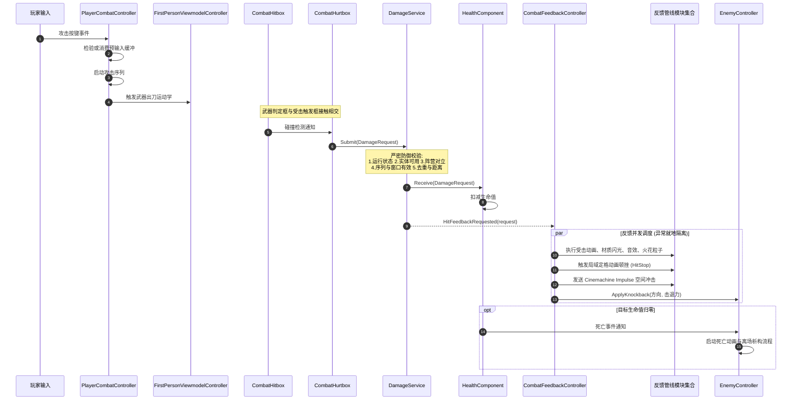
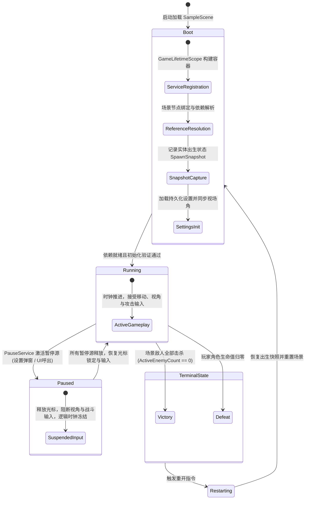
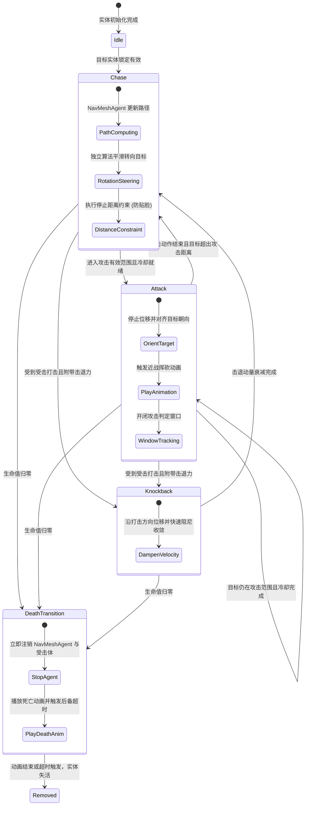

# Tiny Adventure 技术架构与系统设计

> 语言切换：[English](INTRODUCTION.md) | [简体中文](INTRODUCTION_zh.md) | [日本語](INTRODUCTION_jp.md)

## 1. 项目技术规格

[Tiny Adventure](./) 是基于 Unity 6 构建的第一人称近战剑术动作项目。核心玩法聚焦于封闭竞技场内的格斗判定、打击反馈总线、第一人称视口物理表现与敌人行为决策。

| 维度 | 规格选型 | 关键说明 |
|---|---|---|
| **引擎与管线** | Unity 6000.5.9f1 / URP Blank | 采用 Universal Render Pipeline |
| **依赖注入** | VContainer 1.19.0 | [GameLifetimeScope](Assets/Scripts/Core/GameLifetimeScope.cs) 统一注册与注入核心服务，无场景反射轮询 |
| **输入系统** | Unity Input System 1.20.0 | 基于 [InputSystem.inputactions](Assets/InputSystem.inputactions) 代码生成，由 [InputReader](Assets/Scripts/Input/InputReader.cs) 输出业务快照 |
| **相机系统** | Unity Cinemachine 3.1.6 | 第一人称虚拟相机，PanTilt 强类型 InputAxis 驱动，集成冲量监听 |
| **AI 导航** | Unity AI Navigation 2.0.14 | NavMeshAgent 寻路，与物理旋转及防贴脸间距控制解耦 |
| **暂停管理** | 引用计数式 [PauseService](Assets/Scripts/Core/PauseService.cs) | 聚合多源暂停请求，统一管理光标锁定与输入启用 |
| **异常控制** | 零分配结构体 [Result](Assets/Scripts/Core/Result.cs) | 领域错误枚举 [GameError](Assets/Scripts/Core/GameError.cs) 代替热路径异常抛出 |
| **代码规约** | `namespace TinyAdventure` | 源码注释与诊断断言遵循简洁明确的日文规范 |

---

## 2. 核心架构设计原则

### 2.1 伤害验证单一合法入口
武器碰撞体 [CombatHitbox](Assets/Scripts/Combat/CombatHitbox.cs) 仅负责检测重叠并收集受击候选目标，严禁直接修改生命值。所有伤害判定统一封装为只读结构体 [DamageRequest](Assets/Scripts/Combat/DamageRequest.cs)，提交至 [DamageService](Assets/Scripts/Combat/DamageService.cs)。该服务按序执行门禁校验：
1. 全局运行状态校验
2. 双方实体参战有效性与存活状态校验
3. 阵营归属校验
4. 攻击序列时效与单序列去重校验
5. 空间距离阈值校验

校验通过后由 [HealthComponent](Assets/Scripts/Combat/HealthComponent.cs) 执行生命值扣减，并派发受击事件。

### 2.2 战斗受击体与移动碰撞体物理分离
物理移动胶囊体与战斗受击判定彻底解耦。角色根节点的物理控制器负责环境碰撞，受击逻辑由独立的 [CombatHurtbox](Assets/Scripts/Combat/CombatHurtbox.cs) 触发器承担。该组件定义了受击部位倍率并在实体死亡时自动失活碰撞体，消除贴脸卡位与判定死角。

### 2.3 管线化打击反馈中枢与异常隔离
[CombatFeedbackController](Assets/Scripts/Combat/CombatFeedbackController.cs) 订阅伤害服务的受击通知，执行攻击序列与受击实体的组合去重，按序向管线模块分发反馈：
- [AnimationFeedbackHandler](Assets/Scripts/Combat/FeedbackHandlers/AnimationFeedbackHandler.cs)：受击动作触发
- [HitFlashFeedbackHandler](Assets/Scripts/Combat/FeedbackHandlers/HitFlashFeedbackHandler.cs)：基于 MaterialPropertyBlock 的瞬态材质发光
- [AudioFeedbackHandler](Assets/Scripts/Combat/FeedbackHandlers/AudioFeedbackHandler.cs)：普通与致死 3D 音效及音高微扰
- [VfxFeedbackHandler](Assets/Scripts/Combat/FeedbackHandlers/VfxFeedbackHandler.cs)：法线朝向命中粒子生成
- [CameraShakeFeedbackHandler](Assets/Scripts/Combat/FeedbackHandlers/CameraShakeFeedbackHandler.cs)：Cinemachine Impulse 空间冲击
- [HitStopFeedbackHandler](Assets/Scripts/Combat/FeedbackHandlers/HitStopFeedbackHandler.cs)：局域定格动画顿挫，严禁改动全局 Time.timeScale
- [IKnockbackReceiver](Assets/Scripts/Combat/CombatFeedbackContracts.cs)：物理位移动量分发

任意反馈模块异常均由总线就地捕获，保障结算主流程不被中断。

### 2.4 四级组件连接与依赖拓扑
项目确立了严格的四级组件连接拓扑，彻底消除场景动态检索与隐式反模式：

```text
[系统/数据/Manager 之间]        --->  全走 VContainer 注入（接口驱动）
         │
[跨模块调用表现层]             --->  VContainer 注入 View 组件或 EntryPoint 控制
         │
[Prefab 内部部件连接]          --->  [SerializeField] 在 Inspector 中连线
         │
[同一 GameObject 的硬性组件]   --->  [RequireComponent] + GetComponent() 在 Awake 缓存
```

场景根节点通过 [GameLifetimeScope](Assets/Scripts/Core/GameLifetimeScope.cs) 声明核心服务与场景控制器。系统层与管理器层全面面向接口抽象（如 [IDamageService](Assets/Scripts/Combat/IDamageService.cs)、[IGameplayClock](Assets/Scripts/Core/GameplayClock.cs)、[IPauseService](Assets/Scripts/Core/IPauseService.cs)），通过 `[Inject] public void Construct(...)` 进行注入；预制体内部组件严格通过 Inspector 显式序列化引用；同物体的强依赖组件强制标注 `[RequireComponent]` 并在 `Awake` 完成直接缓存。

### 2.5 多源引用计数暂停管理
[PauseService](Assets/Scripts/Core/PauseService.cs) 引入引用计数机制，允许多个来源（设置菜单、游戏结算界面）独立申请与释放暂停。服务依据活跃源计数统一切换光标锁定状态并启闭输入层，避免单一界面退出时错误恢复其他层级的暂停状态。

### 2.6 第一人称视口动力学与阴影分轨
角色第三人称身体网格由 [PlayerFirstPersonMeshHandler](Assets/Scripts/Player/PlayerFirstPersonMeshHandler.cs) 设置为仅投射阴影，消除近裁剪面穿模穿帮。视口长剑由 [FirstPersonViewmodelController](Assets/Scripts/Player/FirstPersonViewmodelController.cs) 独立呈现，组合以下模块：
- [ViewmodelSwayAndBob](Assets/Scripts/Player/Viewmodel/ViewmodelSwayAndBob.cs)：视口晃动与步态颠簸
- [ViewmodelAttackKinetics](Assets/Scripts/Player/Viewmodel/ViewmodelAttackKinetics.cs)：出刀动力学轨迹与受击抖动
- [ViewmodelBladeVisuals](Assets/Scripts/Player/Viewmodel/ViewmodelBladeVisuals.cs)：剑身高光与拖尾

### 2.7 二阶欠阻尼受击弹簧与照准基准不变
[FirstPersonCameraController](Assets/Scripts/Camera/FirstPersonCameraController.cs) 内部解算受击创伤弹簧物理模型。受击引发的俯仰后仰与侧倾仅作为动态偏移量叠加至虚拟相机输出，不污染玩家鼠标的基准瞄准角度，阻尼衰减完毕后瞄准朝向无漂移复原。

### 2.8 动作输入缓冲与三段连击状态机
[PlayerCombatController](Assets/Scripts/Player/PlayerCombatController.cs) 内置 0.25s 预输入缓冲计时器，吸收动作后摇期间的按键输入。配合 [ComboAttackConfig](Assets/Scripts/Combat/Configs/ComboAttackConfig.cs) 执行三段轻攻击平滑递进，具备超时重置保护与攻击窗口状态同步。

### 2.9 敌人决策、运动解耦与防贴脸约束
[EnemyController](Assets/Scripts/Enemy/EnemyController.cs) 统一协调敌人 AI 状态机。巡航位移基于 NavMeshAgent，旋转朝向由平滑算法独立驱动。在接近目标时强制保留 2.1m 停止距离与 2.35m 攻击范围，阻断贴身穿模；实体同时实现 [IKnockbackReceiver](Assets/Scripts/Combat/CombatFeedbackContracts.cs) 接收受击击退。

### 2.10 断言分流与内联错误处理
- **不可恢复错误**：严禁静默吞异常或降级，使用断言（Assert）验证契约不变量与强依赖有效性，同时确保调用端方法能够被 JIT 编译器正确内联。
- **可恢复错误**：严禁在业务流程中抛出异常，使用零分配只读值类型 [Result](Assets/Scripts/Core/Result.cs) 或 `Result<T>`，通过领域枚举 [GameError](Assets/Scripts/Core/GameError.cs) 表达操作失败上下文。

### 2.11 关键热路径零开销控制
- **杜绝内联阻断代码**：高频执行函数（Update、FixedUpdate、碰撞相交检测、伤害提交流水线等）严禁使用 `try/catch` 或包含 `throw` 的不可内联分支，彻底消除栈展开表与寄存器溢出开销。
- **消除冗余分支消耗**：热路径严格规避防御性判空（如多余的 `arg == null`）及 `event?.Invoke()` 间接调用开销，依赖构造期强契约断言与直接接口分发实现真正的零额外耗时。

---

## 3. 架构设计图与数据流

### 3.1 整体分层依赖架构

```mermaid
graph TD
    subgraph Input_Layer ["1. 输入层"]
        Actions["InputSystem.inputactions"] --> Generated["InputSystem.cs"]
        Generated --> Reader["InputReader"]
        Reader --> CamReader["CameraInputReader"]
    end

    subgraph Core_Layer ["2. 核心控制与服务层"]
        Scope["GameLifetimeScope (IoC Container)"]
        Flow["GameFlowController (状态机)"]
        Clock["GameplayClock (解耦时钟)"]
        Pause["PauseService (引用计数暂停)"]
        Registry["SceneReferenceRegistry (实体索引)"]
        Settings["GameSettingsService (设置持久化)"]
        Tracker["GameplayWinLossTracker (胜负监听)"]
        
        Scope --> Flow
        Scope --> Clock
        Scope --> Pause
        Scope --> Registry
        Scope --> Settings
        Flow --> Tracker
    end

    subgraph Player_Presentation ["3. 玩家控制与视口表现"]
        PC["PlayerController (物理位移)"]
        PCC["PlayerCombatController (连击/缓冲)"]
        FPVC["FirstPersonViewmodelController"]
        Kinetics["ViewmodelAttackKinetics"]
        Sway["ViewmodelSwayAndBob"]
        Blade["ViewmodelBladeVisuals"]
        Shadow["PlayerFirstPersonMeshHandler"]
        
        Reader --> PC
        Reader --> PCC
        PCC --> FPVC
        FPVC --> Kinetics
        FPVC --> Sway
        FPVC --> Blade
        PC --> Shadow
    end

    subgraph Enemy_Subsystem ["4. 敌人行为系统"]
        EC["EnemyController (AI状态/运动/受击)"]
        EAD["EnemyAnimationDriver"]
        NMA["NavMeshAgent"]
        
        EC --> EAD
        EC --> NMA
    end

    subgraph Combat_Subsystem ["5. 战斗校验与结算"]
        DS["DamageService (唯一合法入口)"]
        HitboxP["CombatHitbox (Player)"]
        HitboxE["CombatHitbox (Enemy)"]
        HurtboxP["CombatHurtbox (Player)"]
        HurtboxE["CombatHurtbox (Enemy)"]
        HealthP["HealthComponent (Player)"]
        HealthE["HealthComponent (Enemy)"]
        
        HitboxP -.->|接触| HurtboxE
        HitboxE -.->|接触| HurtboxP
        HurtboxE -->|Submit DamageRequest| DS
        HurtboxP -->|Submit DamageRequest| DS
        DS -->|校验通过| HealthE
        DS -->|校验通过| HealthP
    end

    subgraph Feedback_Pipeline ["6. 打击感反馈管线"]
        CFC["CombatFeedbackController (中枢调度)"]
        DS -.->|HitFeedbackRequested| CFC
        
        CFC --> ModAnim["AnimationFeedbackHandler"]
        CFC --> ModFlash["HitFlashFeedbackHandler"]
        CFC --> ModAudio["AudioFeedbackHandler"]
        CFC --> ModVfx["VfxFeedbackHandler"]
        CFC --> ModCam["CameraShakeFeedbackHandler"]
        CFC --> ModStop["HitStopFeedbackHandler"]
        CFC -.->|击退位移| EC
    end

    subgraph Camera_UI ["7. 相机与界面层"]
        CamCtrl["FirstPersonCameraController"]
        Trauma["欠阻尼受击弹簧计算"]
        CM["Cinemachine CM_FirstPerson"]
        HUD["DemoHudController"]
        EHB["EnemyHealthBar"]
        SettingsUI["SettingsDialogController"]
        
        CamReader --> CamCtrl
        CamCtrl --> Trauma
        Trauma --> CM
        Flow --> HUD
        Settings --> SettingsUI
        Pause --> SettingsUI
        HealthE --> EHB
    end
```



### 3.2 战斗结算与表现时序



### 3.3 全局生命周期与暂停状态机



### 3.4 敌人 AI 决策与行为状态机



---

## 4. 源码文件详细说明

全工程源码位于 `Assets/Scripts/` 目录下，划分为 7 个模块，共 64 个源码脚本。

### 4.1 Camera（相机与视线驱动）

| 源码路径 | 核心类型 | 主要职责 | 关键协作 |
|---|---|---|---|
| [FirstPersonCameraController.cs](Assets/Scripts/Camera/FirstPersonCameraController.cs) | `FirstPersonCameraController` | 第一人称视线旋转驱动核心，接收鼠标输入驱动 Yaw/Pitch，集成二阶欠阻尼受击弹簧偏移解算，动态写入 Cinemachine 虚拟相机 PanTilt | [CameraInputReader](Assets/Scripts/Input/CameraInputReader.cs), `CinemachinePanTilt`, [IGameSettingsService](Assets/Scripts/Core/IGameSettingsService.cs) |
| [CombatCameraFeedback.cs](Assets/Scripts/Camera/CombatCameraFeedback.cs) | `CombatCameraFeedback` | 相机受击打击反馈桥接器，驱动 Cinemachine Impulse 生成空间冲击波 | `CinemachineImpulseSource`, [CombatFeedbackProfile](Assets/Scripts/Combat/CombatFeedbackProfile.cs) |

### 4.2 Combat（战斗核心、配置与反馈管线）

#### 战斗判定与生命值管理

| 源码路径 | 核心类型 | 主要职责 | 关键协作 |
|---|---|---|---|
| [DamageService.cs](Assets/Scripts/Combat/DamageService.cs) | `DamageService`<br>[IDamageService](Assets/Scripts/Combat/IDamageService.cs) | 全局唯一伤害裁决服务，执行多重防御门禁校验，分发判定结果 | [DamageRequest](Assets/Scripts/Combat/DamageRequest.cs), [HealthComponent](Assets/Scripts/Combat/HealthComponent.cs), [ICombatantRegistry](Assets/Scripts/Core/CombatantRegistryContracts.cs) |
| [DamageRequest.cs](Assets/Scripts/Combat/DamageRequest.cs) | `DamageRequest`<br>`AttackKinds` | 只读伤害请求值对象，封装攻击方、受击方、基础数值、序列号及空间命中数据 | [CombatantMarker](Assets/Scripts/Core/CombatantMarker.cs) |
| [HealthComponent.cs](Assets/Scripts/Combat/HealthComponent.cs) | `HealthComponent`<br>`HealthState` | 生命值管理组件，维护当前与最大生命值，管控受击扣血与死亡事件分发 | [DamageRequest](Assets/Scripts/Combat/DamageRequest.cs) |
| [CombatHitbox.cs](Assets/Scripts/Combat/CombatHitbox.cs) | `CombatHitbox` | 武器碰撞触发体，在攻击判定窗开启期间检测重叠并向追踪器提交目标候选 | [AttackWindowTracker](Assets/Scripts/Combat/AttackWindowTracker.cs), [ICombatHurtbox](Assets/Scripts/Combat/CombatHurtboxContracts.cs) |
| [CombatHurtbox.cs](Assets/Scripts/Combat/CombatHurtbox.cs) | `CombatHurtbox` | 独立受击判定组件，实现部位伤害倍率映射并在角色死亡时自动停用碰撞 | [ICombatHurtbox](Assets/Scripts/Combat/CombatHurtboxContracts.cs), [HealthComponent](Assets/Scripts/Combat/HealthComponent.cs) |
| [CombatHurtboxContracts.cs](Assets/Scripts/Combat/CombatHurtboxContracts.cs) | `ICombatHurtbox`<br>`HurtboxType` | 受击判定体抽象契约与部位枚举定义 | [CombatantMarker](Assets/Scripts/Core/CombatantMarker.cs), [HealthComponent](Assets/Scripts/Combat/HealthComponent.cs) |
| [AttackSequence.cs](Assets/Scripts/Combat/AttackSequence.cs) | `AttackSequence`<br>`AttackSequencePhase` | 单次攻击生命周期状态机，管理窗口开闭与后备归一化时间关窗安全超时 | [AttackWindowTracker](Assets/Scripts/Combat/AttackWindowTracker.cs) |
| [AttackWindowTracker.cs](Assets/Scripts/Combat/AttackWindowTracker.cs) | `AttackWindowTracker` | 攻击判定窗口跟踪器，维护当前攻击序列命中实体集合，执行单序列去重 | [CombatantMarker](Assets/Scripts/Core/CombatantMarker.cs) |
| [HitFlashReceiver.cs](Assets/Scripts/Combat/HitFlashReceiver.cs) | `HitFlashReceiver` | 材质受击发光接收器，利用 MaterialPropertyBlock 实现无堆分配 HDR 闪光 | `Renderer`, `MaterialPropertyBlock` |
| [HitStopController.cs](Assets/Scripts/Combat/HitStopController.cs) | `HitStopController`<br>[IHitStopController](Assets/Scripts/Combat/IHitStopController.cs) | 局域顿挫定格中枢，向参与者派发顿挫令牌暂停 Animator，不改动全局时间轴 | [HitStopParticipant](Assets/Scripts/Combat/HitStopParticipant.cs) |
| [HitStopParticipant.cs](Assets/Scripts/Combat/HitStopParticipant.cs) | `HitStopParticipant` | 定格参与者组件，响应暂停与恢复请求以控制关联动画播放速度 | `Animator` |
| [SwordTrailController.cs](Assets/Scripts/Combat/SwordTrailController.cs) | `SwordTrailController` | 剑刃拖尾表现器，在有效攻击窗口期间启闭 TrailRenderer 渲染 | `TrailRenderer` |
| [IAttackHitListener.cs](Assets/Scripts/Combat/IAttackHitListener.cs) | `IAttackHitListener` | 攻击命中事件监听接口 | 无 |
| [IHitFeedbackReceiver.cs](Assets/Scripts/Combat/IHitFeedbackReceiver.cs) | `IHitFeedbackReceiver` | 打击反馈接收器契约 | [CombatFeedbackRequest](Assets/Scripts/Combat/CombatFeedbackContracts.cs) |

#### 战斗反馈总线与分发处理器

| 源码路径 | 核心类型 | 主要职责 | 关键协作 |
|---|---|---|---|
| [CombatFeedbackController.cs](Assets/Scripts/Combat/CombatFeedbackController.cs) | `CombatFeedbackController` | 打击感核心调度器，聚合各分发模块并执行序列去重与异常隔离 | [DamageService](Assets/Scripts/Combat/DamageService.cs), 各 FeedbackHandler |
| [CombatFeedbackContracts.cs](Assets/Scripts/Combat/CombatFeedbackContracts.cs) | `ICombatFeedbackModule`<br>`IKnockbackReceiver`<br>`CombatFeedbackRequest` | 打击反馈子模块接口、击退接收接口与反馈请求载荷定义 | [DamageRequest](Assets/Scripts/Combat/DamageRequest.cs) |
| [CombatFeedbackProfile.cs](Assets/Scripts/Combat/CombatFeedbackProfile.cs) | `CombatFeedbackProfile` | 打击表现数据配置资产，聚合顿挫时长、震屏参数、音效及特效引用 | ScriptableObject |
| [AnimationFeedbackHandler.cs](Assets/Scripts/Combat/FeedbackHandlers/AnimationFeedbackHandler.cs) | `AnimationFeedbackHandler` | 反馈分发模块，触发受击目标的受击动作 | `Animator` |
| [HitFlashFeedbackHandler.cs](Assets/Scripts/Combat/FeedbackHandlers/HitFlashFeedbackHandler.cs) | `HitFlashFeedbackHandler` | 反馈分发模块，触发受击目标的材质高光闪烁 | [HitFlashReceiver](Assets/Scripts/Combat/HitFlashReceiver.cs) |
| [AudioFeedbackHandler.cs](Assets/Scripts/Combat/FeedbackHandlers/AudioFeedbackHandler.cs) | `AudioFeedbackHandler` | 反馈分发模块，播放多通道普通/致死命中音效及出刀破空音效 | `AudioSource`, [CombatFeedbackProfile](Assets/Scripts/Combat/CombatFeedbackProfile.cs) |
| [VfxFeedbackHandler.cs](Assets/Scripts/Combat/FeedbackHandlers/VfxFeedbackHandler.cs) | `VfxFeedbackHandler` | 反馈分发模块，沿命中点法线方向实例化火花粒子特效 | `ParticleSystem`, [CombatFeedbackProfile](Assets/Scripts/Combat/CombatFeedbackProfile.cs) |
| [CameraShakeFeedbackHandler.cs](Assets/Scripts/Combat/FeedbackHandlers/CameraShakeFeedbackHandler.cs) | `CameraShakeFeedbackHandler` | 反馈分发模块，分发 Cinemachine 6D 冲击波 | `CinemachineImpulseSource` |
| [HitStopFeedbackHandler.cs](Assets/Scripts/Combat/FeedbackHandlers/HitStopFeedbackHandler.cs) | `HitStopFeedbackHandler` | 反馈分发模块，调用 HitStopController 为攻守双方施加动画定格 | [HitStopController](Assets/Scripts/Combat/HitStopController.cs) |

#### 战斗配置资产声明

| 源码路径 | 核心类型 | 主要职责 | 关键协作 |
|---|---|---|---|
| [AttackConfig.cs](Assets/Scripts/Combat/Configs/AttackConfig.cs) | `AttackConfig` | 单段攻击参数配置，定义基础伤害、击退力、突进力与时间窗参数 | ScriptableObject |
| [ComboAttackConfig.cs](Assets/Scripts/Combat/Configs/ComboAttackConfig.cs) | `ComboAttackConfig` | 连击链配置，组合三段轻攻击序列并定义段位重置时间 | [AttackConfig](Assets/Scripts/Combat/Configs/AttackConfig.cs) |
| [CharacterStatsConfig.cs](Assets/Scripts/Combat/Configs/CharacterStatsConfig.cs) | `CharacterStatsConfig` | 角色基础数值配置，定义最大生命值、移动速度与转向速率 | ScriptableObject |

### 4.3 Core（全局中枢与生命周期）

| 源码路径 | 核心类型 | 主要职责 | 关键协作 |
|---|---|---|---|
| [GameLifetimeScope.cs](Assets/Scripts/Core/GameLifetimeScope.cs) | `GameLifetimeScope` | 场景级依赖注入容器宿主，注册单例服务并自动注入层级核心对象 | `VContainer`, 场景单例服务群 |
| [GameFlowController.cs](Assets/Scripts/Core/GameFlowController.cs) | `GameFlowController`<br>`IGameplayStateProvider` | 全局生命周期状态机管理者，主导启动初始化、终局裁决与场景重置 | [SceneReferenceRegistry](Assets/Scripts/Core/SceneReferenceRegistry.cs), [GameplayClock](Assets/Scripts/Core/GameplayClock.cs) |
| [GameplayState.cs](Assets/Scripts/Core/GameplayState.cs) | `GameplayState` | 全局流程状态枚举：Boot, Running, Victory, Defeat, Restarting | 无 |
| [GameplayClock.cs](Assets/Scripts/Core/GameplayClock.cs) | `GameplayClock`<br>`IGameplayClock` | 独立解耦逻辑时钟，在终局时独立冻结，实现 VContainer 循环更新 | `ITickable`, `IFixedTickable` |
| [PauseService.cs](Assets/Scripts/Core/PauseService.cs) | `PauseService`<br>[IPauseService](Assets/Scripts/Core/IPauseService.cs) | 引用计数式暂停管理器，集中控制输入启用与光标锁定状态 | [InputReader](Assets/Scripts/Input/InputReader.cs) |
| [GameSettingsService.cs](Assets/Scripts/Core/GameSettingsService.cs) | `GameSettingsService`<br>[IGameSettingsService](Assets/Scripts/Core/IGameSettingsService.cs) | 设置持久化服务，管理 FOV 与鼠标灵敏度配置并分发变更事件 | `PlayerPrefsSettingsStorage` |
| [SceneReferenceRegistry.cs](Assets/Scripts/Core/SceneReferenceRegistry.cs) | `SceneReferenceRegistry`<br>[ICombatantRegistry](Assets/Scripts/Core/CombatantRegistryContracts.cs) | 场景实体注册索引，维护玩家与敌人引用，缓存出生快照 | [CombatantMarker](Assets/Scripts/Core/CombatantMarker.cs), [SpawnSnapshot](Assets/Scripts/Core/SpawnSnapshot.cs) |
| [CombatantMarker.cs](Assets/Scripts/Core/CombatantMarker.cs) | `CombatantMarker`<br>`CombatantFaction` | 参战实体身份标记，声明阵营归属、唯一标识与存活状态 | `ICombatant` |
| [CombatantRegistryContracts.cs](Assets/Scripts/Core/CombatantRegistryContracts.cs) | `ICombatant`<br>`ICombatantRegistry` | 参战实体与注册表抽象契约 | [CombatantMarker](Assets/Scripts/Core/CombatantMarker.cs) |
| [GameplayWinLossTracker.cs](Assets/Scripts/Core/GameplayWinLossTracker.cs) | `GameplayWinLossTracker` | 胜负监听器，监听参战各方生命状态并驱动终局判定 | [HealthComponent](Assets/Scripts/Combat/HealthComponent.cs), [GameFlowController](Assets/Scripts/Core/GameFlowController.cs) |
| [GameFlowInputHandler.cs](Assets/Scripts/Core/GameFlowInputHandler.cs) | `GameFlowInputHandler` | 流程输入适配器，响应重开与退出指令 | [InputReader](Assets/Scripts/Input/InputReader.cs) |
| [SpawnSnapshot.cs](Assets/Scripts/Core/SpawnSnapshot.cs) | `SpawnSnapshot` | 出生快照只读结构体，记录实体初始坐标、旋转与血量 | UnityEngine |
| [Result.cs](Assets/Scripts/Core/Result.cs) | `Result`<br>`Result<T>` | 零堆分配操作结果结构体，统一封装领域成功与失败判定 | [GameError](Assets/Scripts/Core/GameError.cs) |
| [GameError.cs](Assets/Scripts/Core/GameError.cs) | `GameError` | 领域错误枚举定义 | 无 |
| [GameAppUtils.cs](Assets/Scripts/Core/GameAppUtils.cs) | `GameAppUtils` | 应用退出环境工具，区分 Editor 运行与独立客户端构建 | UnityEngine |

### 4.4 Enemy（敌人决策与控制）

| 源码路径 | 核心类型 | 主要职责 | 关键协作 |
|---|---|---|---|
| [EnemyController.cs](Assets/Scripts/Enemy/EnemyController.cs) | `EnemyController` | 敌人综合控制器，整合 AI 决策状态机、NavMesh 追踪、防穿模间距控制、攻击执行、物理击退与死亡离场 | `NavMeshAgent`, [CombatHitbox](Assets/Scripts/Combat/CombatHitbox.cs), [DamageService](Assets/Scripts/Combat/DamageService.cs), [IKnockbackReceiver](Assets/Scripts/Combat/CombatFeedbackContracts.cs) |
| [EnemyAnimationDriver.cs](Assets/Scripts/Enemy/EnemyAnimationDriver.cs) | `EnemyAnimationDriver` | 敌人动画驱动器，映射移动速度至步行参数，标准化触发攻击、受击与死亡动作 | `Animator` |

### 4.5 Input（输入映射与业务适配）

| 源码路径 | 核心类型 | 主要职责 | 关键协作 |
|---|---|---|---|
| [InputSystem.cs](Assets/Scripts/Input/InputSystem.cs) | `InputSystem` | 基于 inputactions 自动生成的强类型包装类 | Unity.InputSystem |
| [InputReader.cs](Assets/Scripts/Input/InputReader.cs) | `InputReader`<br>`GameplayInputSnapshot` | 业务输入主读取器，输出不可变快照，支持业务层统一挂起输入 | [InputSystem](Assets/Scripts/Input/InputSystem.cs) |
| [CameraInputReader.cs](Assets/Scripts/Input/CameraInputReader.cs) | `CameraInputReader`<br>`CameraInputSnapshot` | 相机视角输入专用读取器，提取平滑只读旋转参数 | [InputReader](Assets/Scripts/Input/InputReader.cs) |

### 4.6 Player（玩家控制与视口表现）

| 源码路径 | 核心类型 | 主要职责 | 关键协作 |
|---|---|---|---|
| [PlayerController.cs](Assets/Scripts/Player/PlayerController.cs) | `PlayerController` | 玩家位移物理控制器，基于 CharacterController 执行视角相对移动与接地检测 | `CharacterController`, [InputReader](Assets/Scripts/Input/InputReader.cs) |
| [PlayerCombatController.cs](Assets/Scripts/Player/PlayerCombatController.cs) | `PlayerCombatController` | 玩家轻攻击连击主控，管理三段连击状态与 0.25s 动作预输入缓冲 | [DamageService](Assets/Scripts/Combat/DamageService.cs), [ComboAttackConfig](Assets/Scripts/Combat/Configs/ComboAttackConfig.cs), [FirstPersonViewmodelController](Assets/Scripts/Player/FirstPersonViewmodelController.cs) |
| [PlayerAnimationDriver.cs](Assets/Scripts/Player/PlayerAnimationDriver.cs) | `PlayerAnimationDriver` | 玩家第三人称模型动画驱动器，映射移动状态并触发连击动画 | `Animator` |
| [PlayerFirstPersonMeshHandler.cs](Assets/Scripts/Player/PlayerFirstPersonMeshHandler.cs) | `PlayerFirstPersonMeshHandler` | 模型阴影分轨处理器，将第三人称全身网格设为 ShadowsOnly 消除视口穿模 | `SkinnedMeshRenderer` |
| [FirstPersonViewmodelController.cs](Assets/Scripts/Player/FirstPersonViewmodelController.cs) | `FirstPersonViewmodelController`<br>[IPlayerViewmodel](Assets/Scripts/Player/IPlayerViewmodel.cs) | 第一人称视口表现中枢，协调武器出刀动力学、摆动阻尼与刃部特效 | Viewmodel 各子模块 |
| [ViewmodelSwayAndBob.cs](Assets/Scripts/Player/Viewmodel/ViewmodelSwayAndBob.cs) | `ViewmodelSwayAndBob` | 视口武器阻尼摆动与步态颠簸计算器 | UnityEngine |
| [ViewmodelAttackKinetics.cs](Assets/Scripts/Player/Viewmodel/ViewmodelAttackKinetics.cs) | `ViewmodelAttackKinetics` | 视口武器出刀运动学求解器，计算挥刀位移曲线、微震与受击震颤回弹 | [ViewmodelAttackKineticsConfig](Assets/Scripts/Player/Viewmodel/ViewmodelAttackKineticsConfig.cs) |
| [ViewmodelAttackKineticsConfig.cs](Assets/Scripts/Player/Viewmodel/ViewmodelAttackKineticsConfig.cs) | `ViewmodelAttackKineticsConfig`<br>`AttackMotionPose` | 出刀运动学轨迹与受击震颤参数配置资产 | ScriptableObject |
| [ViewmodelBladeVisuals.cs](Assets/Scripts/Player/Viewmodel/ViewmodelBladeVisuals.cs) | `ViewmodelBladeVisuals` | 视口武器长剑拖尾与攻击期间刀身高光发光控制器 | `TrailRenderer`, `MaterialPropertyBlock` |

### 4.7 UI（界面表现与交互绑定）

| 源码路径 | 核心类型 | 主要职责 | 关键协作 |
|---|---|---|---|
| [DemoHudController.cs](Assets/Scripts/UI/DemoHudController.cs) | `DemoHudController` | 战斗 HUD 控制器，响应式绑定玩家生命值、剩余敌人计数与终局结算面板 | [GameFlowController](Assets/Scripts/Core/GameFlowController.cs), [HealthComponent](Assets/Scripts/Combat/HealthComponent.cs) |
| [EnemyHealthBar.cs](Assets/Scripts/UI/EnemyHealthBar.cs) | `EnemyHealthBar` | 敌人世界坐标血条，实时朝向主相机，支持双层延迟追随缓冲与非战斗平滑淡出 | [HealthComponent](Assets/Scripts/Combat/HealthComponent.cs) |
| [SettingsDialogController.cs](Assets/Scripts/UI/SettingsDialogController.cs) | `SettingsDialogController` | 游戏设置弹窗，双向绑定 FOV 与鼠标灵敏度滑动条，协同 PauseService 冻结游戏 | [GameSettingsService](Assets/Scripts/Core/GameSettingsService.cs), [IPauseService](Assets/Scripts/Core/IPauseService.cs) |

---

## 5. 场景层级与预制体设计

### 5.1 场景语义根节点拓扑

运行场景位于 [Assets/Scenes/SampleScene.unity](Assets/Scenes/SampleScene.unity)，划分为五个职责分明的根节点：

1. **`_MANAGEMENT_`**
   - `GameRoot`：挂载 [GameLifetimeScope](Assets/Scripts/Core/GameLifetimeScope.cs) 与核心服务群（[DamageService](Assets/Scripts/Combat/DamageService.cs)、[GameFlowController](Assets/Scripts/Core/GameFlowController.cs)、[GameplayClock](Assets/Scripts/Core/GameplayClock.cs)、[SceneReferenceRegistry](Assets/Scripts/Core/SceneReferenceRegistry.cs)、[CombatFeedbackController](Assets/Scripts/Combat/CombatFeedbackController.cs)、[HitStopController](Assets/Scripts/Combat/HitStopController.cs)、[CombatCameraFeedback](Assets/Scripts/Camera/CombatCameraFeedback.cs)）。
   - `Navigation`：包含巡航网格与各角色生成点锚点。
2. **`_ENVIRONMENT_`**
   - 包含通行地面、物理阻隔边界与装饰网格体；配置定向主光源与全局后处理体积。
3. **`_CHARACTERS_`**
   - `Player`：主角实例，挂载预制体 [Knight.prefab](Assets/Prefabs/KayKitBattle/Knight.prefab)。
   - `Enemies`：敌人实例容器，容纳近战小怪预制体 [Enemy_Melee.prefab](Assets/Prefabs/KayKitBattle/Enemy_Melee.prefab)。
4. **`_CAMERAS_`**
   - 包含主渲染相机与挂载有 `CinemachineImpulseListener` 的第一人称虚拟相机。
5. **`_UI_`**
   - 包含界面预制体 [HUDRoot.prefab](Assets/Prefabs/KayKitBattle/HUDRoot.prefab) 与 Unity EventSystem。

### 5.2 核心预制体结构

#### [Knight.prefab](Assets/Prefabs/KayKitBattle/Knight.prefab)
- **根节点**：挂载 `CharacterController`、[CombatantMarker](Assets/Scripts/Core/CombatantMarker.cs) (`Faction: Player`)、[HealthComponent](Assets/Scripts/Combat/HealthComponent.cs)、[HitFlashReceiver](Assets/Scripts/Combat/HitFlashReceiver.cs)、[PlayerController](Assets/Scripts/Player/PlayerController.cs)、[PlayerCombatController](Assets/Scripts/Player/PlayerCombatController.cs)、[HitStopParticipant](Assets/Scripts/Combat/HitStopParticipant.cs)、[InputReader](Assets/Scripts/Input/InputReader.cs)、[CameraInputReader](Assets/Scripts/Input/CameraInputReader.cs)。
- **受击体节点 `Hurtboxes/TorsoHurtbox`**：挂载 [CombatHurtbox](Assets/Scripts/Combat/CombatHurtbox.cs) 与 Trigger `CapsuleCollider`，将战斗判定从移动物理中剥离。
- **相机追踪节点 `CameraTarget`**：作为 Cinemachine 虚拟相机跟随与旋转对齐目标。
- **视口层级 `CameraTarget/FirstPersonViewmodel`**：挂载 [FirstPersonViewmodelController](Assets/Scripts/Player/FirstPersonViewmodelController.cs) 与视口长剑模型，包含 [SwordTrailController](Assets/Scripts/Combat/SwordTrailController.cs) 与带有 Trigger 的 [CombatHitbox](Assets/Scripts/Combat/CombatHitbox.cs)。
- **第三人称模型 `KayKitKnight`**：挂载 [PlayerAnimationDriver](Assets/Scripts/Player/PlayerAnimationDriver.cs) 与 [PlayerFirstPersonMeshHandler](Assets/Scripts/Player/PlayerFirstPersonMeshHandler.cs)，全身模型设为仅投射阴影。

#### [Enemy_Melee.prefab](Assets/Prefabs/KayKitBattle/Enemy_Melee.prefab)
- **根节点**：挂载 `NavMeshAgent`、移动物理碰撞体、[CombatantMarker](Assets/Scripts/Core/CombatantMarker.cs) (`Faction: Enemy`)、[HealthComponent](Assets/Scripts/Combat/HealthComponent.cs)、[HitFlashReceiver](Assets/Scripts/Combat/HitFlashReceiver.cs)、[EnemyController](Assets/Scripts/Enemy/EnemyController.cs)、[HitStopParticipant](Assets/Scripts/Combat/HitStopParticipant.cs)。
- **受击体节点 `Hurtboxes/TorsoHurtbox`**：挂载 [CombatHurtbox](Assets/Scripts/Combat/CombatHurtbox.cs) 与 Trigger `CapsuleCollider`，角色阵亡后自动失活。
- **头顶 UI 节点 `HealthBarCanvas`**：挂载 [EnemyHealthBar](Assets/Scripts/UI/EnemyHealthBar.cs)。
- **模型与武器节点**：挂载 [EnemyAnimationDriver](Assets/Scripts/Enemy/EnemyAnimationDriver.cs) 以及附带 Trigger 碰撞体的 [CombatHitbox](Assets/Scripts/Combat/CombatHitbox.cs)。

#### [HUDRoot.prefab](Assets/Prefabs/KayKitBattle/HUDRoot.prefab)
- 挂载 [DemoHudController](Assets/Scripts/UI/DemoHudController.cs)，负责生命值、存活敌人数与终局结算面板呈现。
- 挂载 [SettingsDialogController](Assets/Scripts/UI/SettingsDialogController.cs)，提供 FOV 与鼠标灵敏度调节，呼出时协同暂停服务冻结逻辑时钟并释放光标。

---

## 6. 配置资产与程序集定义

### 6.1 核心 ScriptableObject 配置资产

| 资产路径 | 资产类型 | 核心配置项 |
|---|---|---|
| [CombatFeedbackProfile.asset](Assets/Settings/CombatFeedbackProfile.asset) | [CombatFeedbackProfile](Assets/Scripts/Combat/CombatFeedbackProfile.cs) | 顿挫定格时长 (Normal: 0.04s, Lethal: 0.08s)、震屏冲量参数、命中音效与火花粒子预制体引用 |
| [KnightComboAttackConfig.asset](Assets/Combat/Configs/KnightComboAttackConfig.asset) | [ComboAttackConfig](Assets/Scripts/Combat/Configs/ComboAttackConfig.cs) | 玩家三段轻攻击连击链参数、伤害递增序列、前突位移冲力与 1.2s 连击重置超时 |
| [EnemyAttackConfig.asset](Assets/Combat/Configs/EnemyAttackConfig.asset) | [AttackConfig](Assets/Scripts/Combat/Configs/AttackConfig.cs) | 敌人近战攻击基础数值、攻击判定窗口与受击击退力 |
| [KnightStatsConfig.asset](Assets/Combat/Configs/KnightStatsConfig.asset) | [CharacterStatsConfig](Assets/Scripts/Combat/Configs/CharacterStatsConfig.cs) | 玩家基础生命值与移动速度 |
| [EnemyStatsConfig.asset](Assets/Combat/Configs/EnemyStatsConfig.asset) | [CharacterStatsConfig](Assets/Scripts/Combat/Configs/CharacterStatsConfig.cs) | 敌人基础生命值与巡航参数 |

### 6.2 程序集定义

- **主运行时程序集**：[TinyAdventure.asmdef](Assets/Scripts/TinyAdventure.asmdef)
  - 根命名空间：`TinyAdventure`
  - 依赖引用：`Unity.InputSystem`, `Unity.Cinemachine`, `Unity.AI.Navigation`, `VContainer`
