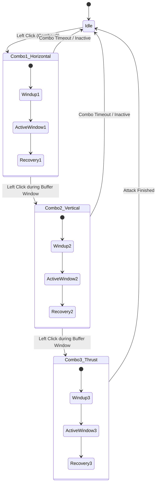

# プレイヤー3段コンボ攻撃（横薙ぎ・縦斬り・突進刺突）設計仕様書

## 1. 概要と目的 (Overview & Objective)
Tiny Adventureにおけるプレイヤー（Knight）の近接攻撃は、単一の縦斬り（`Throw`クリップ流用）のみで構成されており、連続入力を行っても同じ動作の繰り返しとなるため、アクションとしての単調感がありました。

本設計では、ユーザー選択の「方案1：三段連撃システム（3-Hit Combo System）」に基づき、プレイヤーの攻撃を以下の3段構成へ拡張します：
1. **第1段：横薙ぎ（Horizontal Slash）**：
   - 迅速な横方向の薙ぎ払い。出が早く、攻撃範囲（判定角度）が広いため初手・群れへの迎撃に最適。
2. **第2段：縦斬り（Vertical Slash）**：
   - 既存の力強い縦方向振り下ろし。縦方向の破勢力と中威力を兼ね備える。
3. **第3段：突進刺突（Thrust Finisher）**：
   - 大きく前方に踏み込み（Lunge）、剣先を一直線に突き刺すフィニッシュ攻撃。最長射程・最高ダメージ・強力なノックバックを誇る。

---

## 2. コンボ状態機械と入力バッファ設計 (Combo State Machine & Buffering)

### コンボ遷移ルール
1. **コンボ段数 (`comboIndex`)**:
   - 初期状態: `0`（待機状態）。
   - 初回攻撃: `comboIndex = 0`（第1段：横薙ぎ）を発動。
   - 判定後隙（Recovery）中に入力バッファ（`InputBuffer`）に次の攻撃が蓄積されている場合、前段の完了直後（`AttackCompletionNormalizedTime` 到達時）に次段へ遷移：
     - `0 -> 1`（第2段：縦斬り）
     - `1 -> 2`（第3段：突進刺突）
     - `2 -> 0`（フィニッシャー後は待機へ復帰）
2. **コンボ受付猶予時間 (`comboResetTimeout`)**:
   - 攻撃完了後、プレイヤーが追加入力をしないまま一定時間（例：`0.45秒`）が経過した場合、`comboIndex` を `0` に自動リセット。
   - 被ダメージ時（`TriggerHit`）、死亡時（`TriggerDeath`）、回避/ジャンプ等による中断時は直ちに `comboIndex = 0` にリセット。
3. **後方互換性**:
   - 敵AI（`EnemyMeleeCombat`）や既存の単発攻撃検証テストは、単一設定または第1段（あるいは縦斬り）を安全に既定値として参照可能。

---

## 3. 各段の動能感（Kinetics）と戦闘パラメータ (Combat Parameters per Step)

| パラメータ | 第1段：横薙ぎ (Horizontal) | 第2段：縦斬り (Vertical) | 第3段：突進刺突 (Thrust) | 目的・設計意図 |
| :--- | :--- | :--- | :--- | :--- |
| **ダメージ (`AttackDamage`)** | 20.0f | 25.0f | 40.0f | 段数が進むほど高威力となるメリハリ |
| **有効射程 (`AttackRange`)** | 2.2f | 2.2f | 2.8f | 刺突は長大なリーチで敵を貫通・先制可能 |
| **踏み込み距離 (`LungeDistance`)** | 0.8m | 1.2m | 2.2m | 刺突時に一気に間合いを詰める疾走感 |
| **踏み込み時間 (`LungeDuration`)** | 0.12s | 0.15s | 0.20s | シャープな初速と素早い収束 |
| **速度倍率 (`SpeedMultiplier`)** | 1.7x | 1.6x | 1.5x | 初段は素早く、終段は重量感あるフィニッシュ |
| **判定終了 (`WindowCloseTime`)** | 0.50 | 0.55 | 0.60 | 斬撃軌道に合致した判定終了時刻 |
| **動作完了 (`CompletionTime`)** | 0.65 | 0.70 | 0.75 | 次の段への軽快な連携を阻害しないテンポ |

---

## 4. アニメーション及びAnimatorコントローラー設計 (Animation & Controller)

### 1. アニメーションクリップ（Rig_Medium準拠）
`KayKit` の汎用骨骼構造（`Rig_Medium/root/hips/spine/chest/upperarm.r/lowerarm.r/wrist.r/hand.r`）に対応する2つの新規クリップを作成・配備します：
- **`Assets/Animations/Clips/Slash_Horizontal.anim`**:
  - 右腕を右後方から前胸を横切るように水平スイング。上体（chest/spine）が右から左へ軽やかに旋回。
- **`Assets/Animations/Clips/Thrust.anim`**:
  - 剣を胸元へ引き絞った姿勢から前方（Z軸方向）へ力強く突き出す。腰（hips）が沈み込み、踏み込み足の体重移動を表現。
- **既存 `Throw`（縦斬り）**:
  - 第2段として継続使用。

### 2. Animator Controller (`CharacterCombat.controller`) 構成
- パラメータ追加:
  - `ComboIndex` (Integer, 0〜2)
  - `AttackTrigger` (Trigger, 既存流用)
- 状態ステート構成:
  - `Attack_Horizontal`（Motion: `Slash_Horizontal`）
  - `Attack_Vertical`（Motion: `Throw`）
  - `Attack_Thrust`（Motion: `Thrust`）
- 遷移:
  - `Idle` / `Locomotion` -> `Attack_Horizontal` (`AttackTrigger` && `ComboIndex == 0`)
  - `Idle` / `Locomotion` -> `Attack_Vertical` (`AttackTrigger` && `ComboIndex == 1`)
  - `Idle` / `Locomotion` -> `Attack_Thrust` (`AttackTrigger` && `ComboIndex == 2`)
  - 各攻撃状態 -> 次の攻撃状態への先行入力遷移、または通常完了で `Idle` / `Locomotion` へ復帰（ExitTime制御）。

---

## 5. クラス構成と拡張 (Class Architecture)

1. **`ComboAttackConfigSO` (新規 ScriptableObject)**:
   - 3段分の `AttackConfigSO`（または `AttackConfig` 構造体配列）を保持。
   - インスペクター上で各段のダメージ、射程、踏み込み量、速度倍率を個別に微調整可能。
2. **`PlayerCombatController` (機能拡張)**:
   - `comboIndex`（0, 1, 2）および `comboResetTimer` の管理。
   - `TryStartAttack` 時に現在の `comboIndex` に応じたパラメータ（ダメージ、射程、突進量、アニメーション速度）を適用。
   - 攻撃完了時のバッファ判定による次段即時発動、または猶予タイマー起動。
3. **`PlayerAnimationDriver` (拡張)**:
   - `ComboIndex` パラメータを Animator に伝達する `SetComboIndex(int index)` の追加。

---

## 6. テストと検証方針 (Verification & Standards)

1. **単体テスト（EditMode Tests）**:
   - コンボ段数の進行（0 -> 1 -> 2 -> 0）が正しく行われること。
   - 入力のない状態で一定時間経過後にコンボ段数が 0 にリセットされること。
   - 被撃時・キャンセル時にコンボ段数が安全に初期化されること。
   - 各段において異なるダメージ・突進パラメータが正しく供給されること。
2. **統合テスト（PlayMode Tests）**:
   - 連続マウスクリックにより、3段の異なる攻撃ステートが順次再生されること。
   - 刀光トレイルおよび効果音が各段で適切に再生されること。
3. **シーン整合性（DemoSceneValidator）**:
   - `DemoSceneValidator.ValidateCurrentScene()` でエラー 0件・警告 0件を維持すること。
4. **日本語テキスト監査（JapaneseTextAudit）**:
   - 新規スクリプト、注釈、ログ、インスペクター表示がすべて日本語規範に準拠していること。
